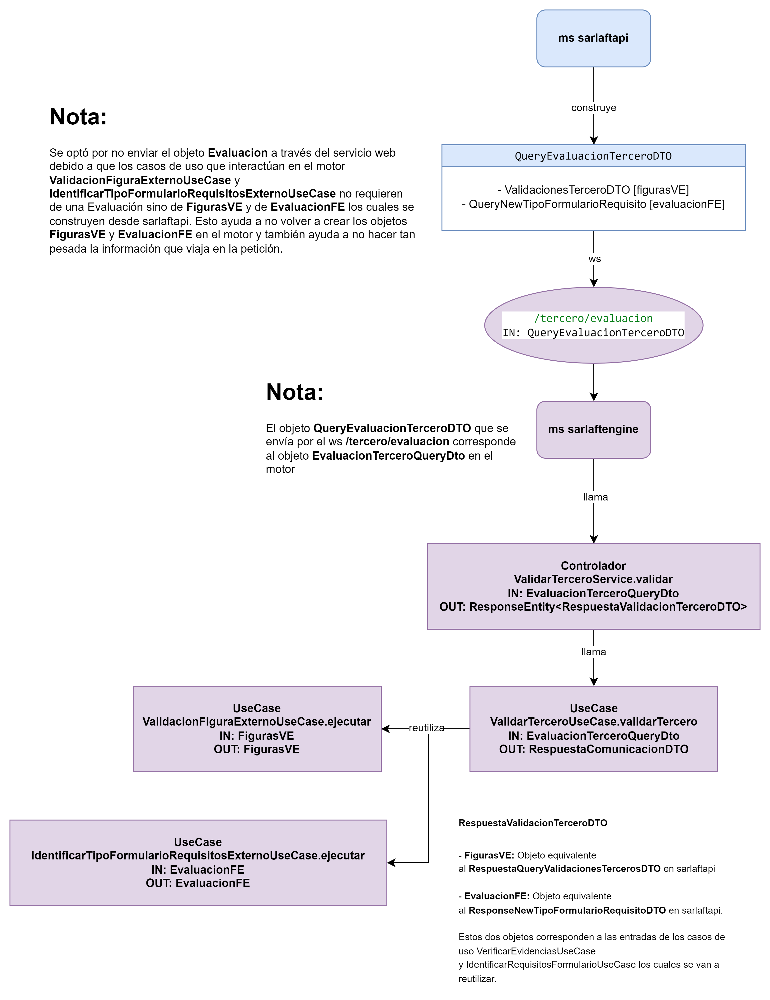

# Servicio validaciones para la evaluación de terceros - sarlaftengine

> **Fuente Confluence:** [Servicio validaciones para la evaluación de terceros - sarlaftengine](https://segurosti.atlassian.net/wiki/spaces/EPA/pages/3677782053/Servicio+validaciones+para+la+evaluaci+n+de+terceros+-+sarlaftengine)
> **Última modificación:** 2024-04-18 — Julián Andrés Curubo García · versión 3
> **Sección:** [Servicios Web - SarlaftEngine](./index.md)

## Archivos adjuntos

| Archivo | Enlace |
| --------- | -------- |
| `image-20240418-000241.png` | [image-20240418-000241.png](./attachments/image-20240418-000241.png) |
| `image-20240417-235835.png` | [image-20240417-235835.png](./attachments/image-20240417-235835.png) |
| `image-20240417-235814.png` | [image-20240417-235814.png](./attachments/image-20240417-235814.png) |

- **Objetivo:**Este servicio se encarga de realizar las validaciones de figuras y de identificar el formulario de requisitos. Este servicio se expone en reemplazo de la comunicación request reply que se tenía por medio del service bus, donde se integran las funcionalidades de los siguientes querys: Evaluacion.externos.sarlaft.formulario.requisitos y Evaluacion.externos.sarlaft.validaciones.

- **Endpoint:** /sarlaftengineserv/api/tercero/evaluacion

- **Perfil de Seus4:**NO aplica. Este servicio se expone interno al cluster del aks, por lo tanto se convierte en una comunicación back to back.

- **Ejemplo Json Request:**

```text
{
  "figurasVE": {
    "validacionesDTO": [
      {
        "sarlaft": {
          "id": "33072182-1dec-4574-98ec-67e0bb4400c2",
          "cliente": {
            "tipoPersona": "N"
          },
          "riesgo": {
            "tipoRiesgo": "SIMPLIFICADO",
            "bloqueante": false,
            "indicadorRegimenPublico": false
          }
        }
      }
    ],
    "codigoOperacion": "01",
    "evaluacionId": "04e07b33-a442-47c2-a044-24d3e55b362c"
  },
  "evaluacionFE": {
    "sarlafts": [
      {
        "id": "33072182-1dec-4574-98ec-67e0bb4400c2",
        "tipoPersona": "N",
        "tipoRiesgo": "SIMPLIFICADO",
        "figuras": [
          {
            "dsfigura": "TOMADOR"
          }
        ]
      }
    ],
    "codigoRamo": "1"
  }
}
```text

- **Ejemplo Json Response:**

```text
{
    "meta": null,
    "data": [
        {
            "type": "RespuestaComunicacion",
            "id": "04e07b33-a442-47c2-a044-24d3e55b362c",
            "attributes": {
                "figurasVE": {
                    "validacionesDTO": [
                        {
                            "sarlaft": {
                                "id": "33072182-1dec-4574-98ec-67e0bb4400c2",
                                "cliente": {
                                    "tipoPersona": "N"
                                },
                                "riesgo": {
                                    "tipoRiesgo": "SIMPLIFICADO"
                                }
                            },
                            "validaciones": [
                                {
                                    "codigo": "RRCC",
                                    "bloqueante": true
                                },
                                {
                                    "codigo": "DOCUMENT_PN",
                                    "bloqueante": true
                                }
                            ],
                            "flowlog": [
                                "TSTAR-7440 Validacion 3"
                            ],
                            "lastFlowlog": "TSTAR-7440 Validacion 3"
                        }
                    ],
                    "codigoOperacion": "01",
                    "error": null,
                    "evaluacionId": "04e07b33-a442-47c2-a044-24d3e55b362c"
                },
                "evaluacionFE": {
                    "id": null,
                    "sarlafts": [
                        {
                            "id": "33072182-1dec-4574-98ec-67e0bb4400c2",
                            "tipoPersona": "N",
                            "tipoRiesgo": "SIMPLIFICADO",
                            "tipoFormulario": "SIMPLIFICADO_PN",
                            "figuras": [
                                {
                                    "dsfigura": "TOMADOR"
                                }
                            ],
                            "requisitos": [],
                            "flowlog": [
                                "Condición TSTAR-7440_3"
                            ]
                        }
                    ],
                    "codigoRamo": "1",
                    "error": null
                }
            }
        }
    ],
    "included": null
}
```

**Diagrama de comunicación:**

