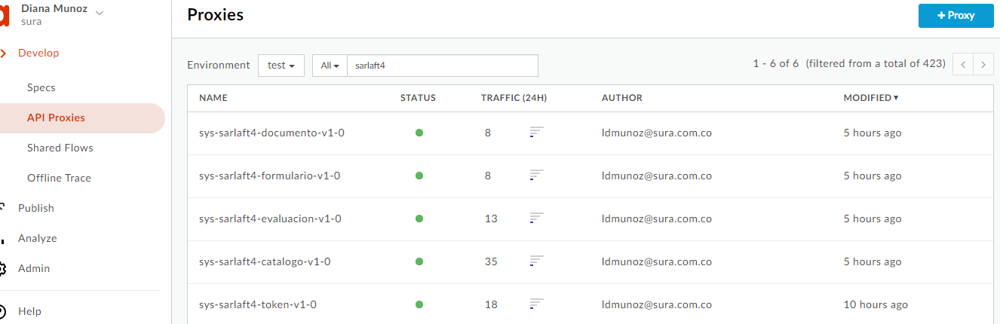
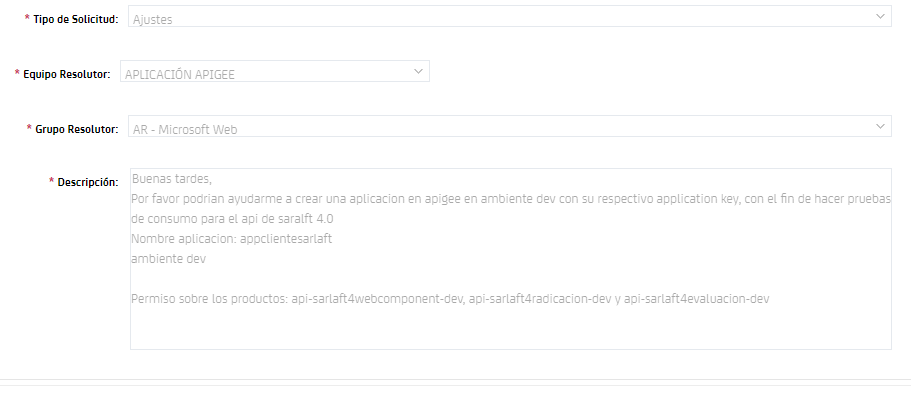
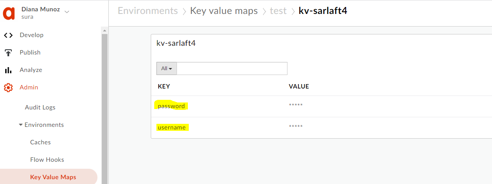
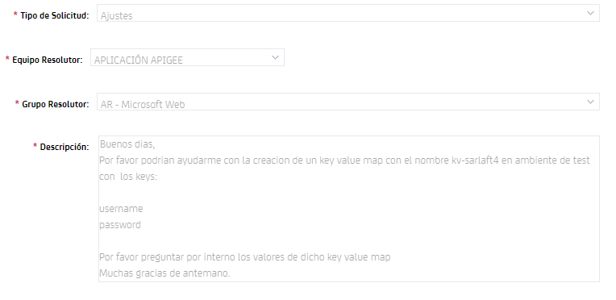
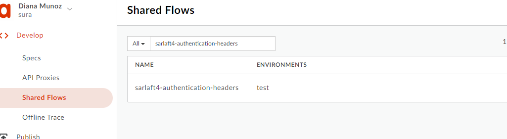
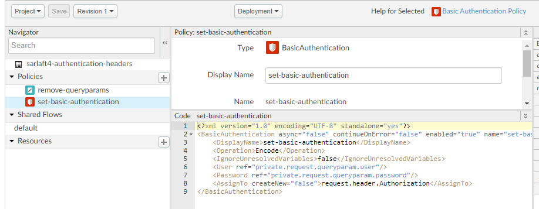
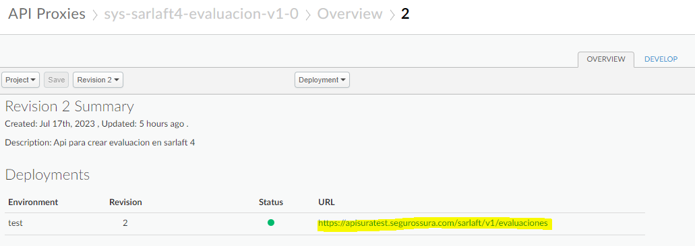
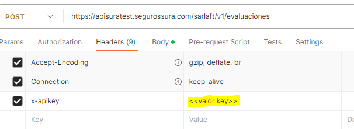

# Apis en Apigee Laboratorio

> **Fuente Confluence:** [Apis en Apigee Laboratorio](https://segurosti.atlassian.net/wiki/spaces/EPA/pages/3359932647)
> **Última modificación:** 2024-01-16 — Diana Muñoz · versión 6
> **Sección:** [DISEÑO APIS](./index.md)

De acuerdo a las definiciones dadas desde el aplicativo sarlaft 4.0 para integraciones con aliados externos ([Diligenciamiento Plantilla Creacion APIs](../DocumentacionTecnicaServicios/DiligenciamientoPlantillaAPIs.md)) y de acuerdo a la documentación técnica de apigee Sura ([Apigee](https://segurosti.atlassian.net/wiki/spaces/AR/pages/2812543042/Apigee))

se creo en ApiGee Laboratorio los siguientes proxys para consumo de saralft.

| **Proxy** | **Path** | **Tipo** | **Seguridad** | **Target Servicio Web** | **Backend** | **Seguridad** |
|---|---|---|---|---|---|---|
| `sys-sarlaft4-catalogo-v1-0` | https://apisuratest.segurossura.com/sarlaft/v1/catalogos | GET | Authorization ApiKey | `/sarlaftserv/v1/catalogos` | `SarlaftAPI` | Authorization Basic - Seus 4 |
| `sys-sarlaft4-evaluacion-v1-0` | https://apisuratest.segurossura.com/sarlaft/v1/evaluaciones | PUT | Authorization ApiKey | `/sarlaftserv/v1/evaluaciones` | `SarlaftAPI` | Authorization Basic - Seus 4 |
| `sys-sarlaft4-evaluacion-v1-0` | https://apisuratest.segurossura.com/sarlaft/v1/evaluaciones | POST | Authorization ApiKey | `/sarlaftserv/v1/evaluaciones` | `SarlaftAPI` | Authorization Basic - Seus 4 |
| `sys-sarlaft4-formulario-v1-0` | https://apisuratest.segurossura.com/sarlaft/v1/formularios | POST | Authorization ApiKey | `/sarlaftserv/v1/formularios` | `SarlaftAPI` | Authorization Basic - Seus 4 |
| `sys-sarlaft4-documento-v1-0` | https://apisuratest.segurossura.com/sarlaft/v1/documentos | POST | Authorization ApiKey | `/sarlaftserv/v1/documentos` | `SarlaftAPI` | Authorization Basic - Seus 4 |
| `sys-sarlaft4-token-v1-0` | https://apisuratest.segurossura.com/sarlaft/v1/token | GET | Authorization ApiKey | `/sarlaftserv/v1/token` | `SarlaftAPI` | Authorization Basic - Seus 4 |

Dado que no había ningún procesamiento u orquestación de los servicios desde lineamiento de negocio, no existen proxys en la capa de proceso.

Por lineamientos de la compañía se crea un solo producto llamado: **`api-sarlaft4-test`**.

| **Producto** | **Proxy** |
|---|---|
| `api-sarlaft4-test` | `sys-sarlaft4-catalogo-v1-0` |
| | `sys-sarlaft4-evaluacion-v1-0` (post) |
| | `sys-sarlaft4-evaluacion-v1-0` (put) |
| | `sys-sarlaft4-formulario-v1-0` |
| | `sys-sarlaft4-documento-v1-0` |
| | `sys-sarlaft4-token-v1-0` |

**Otros componentes creados en apigee que son utilizados:**

**Aplicación**: **`appclientesarlaft`**. Aplicación de ejemplo para consumos del api de sarlaft 4.0 (utilizado unicamente al interior del proyecto sarlaft 4.0), se debe solicitar la creación de una aplicación para cada aliado que desee hacer uso del api en ambiente de laboratorio. Esto se puede realizar mediante una solicitud en el Catalogo de Servicios CA por la categoría de Requerimientos Operacion. ([Procedimiento para realizar solicitudes para la plataforma Apigee](https://suramericana.sharepoint.com/sites/Apis380/Shared%20Documents/Forms/AllItems.aspx?id=%2Fsites%2FApis380%2FShared%20Documents%2FGeneral%2FActividades%20Arus%2Fpdf%20documentaci%C3%B3n%2FProcedimiento%20para%20realizar%20solicitudes%20para%20la%20plataforma%20Apigee%2E%2Epdf&parent=%2Fsites%2FApis380%2FShared%20Documents%2FGeneral%2FActividades%20Arus%2Fpdf%20documentaci%C3%B3n))

**Key Value Maps:** **`kv-sarlaft4`**. Contiene los valores encriptados para usuario y clave utilizados en la autenticación basic para el consumo al interior del api con los servicios de sarlaft 4.0

Si no se cuenta con los permisos necesarios se puede realizar la solicitud de creación en el Catalogo de Servicios CA por la categoría de Requerimientos Operacion

**Shared Flows: `sarlaft4-authentication-headers`.** Este flujo se utiliza en todos los proxys de saralft 4.0, fue necesario crear uno nuevo dado que los existentes fallaban al obtener los parámetros de usuario y clave encriptados del Key Value Map.

**Consumo del api:**

Para consumir el api se debe utilizar la url del ambiente de test (laboratorio) y configurar el header **`x-apikey`** con el key generado para la aplicación **`appclientesarlaft`**, este key es informado una vez ejecuten la solicitud realizada por medio del CA.

Para realizar el consumo en ambiente de laboratorio los servicios web de sarlaft 4.0 en este ambiente debieron ser expuestos a internet con el permiso de acceso solo desde la ip de apigee Sura, para esto se debe realizar una solicitud de este tipo Seguridad - **Publicaciones de Aplicaciones en Internet** realizando la observacion que los permisos solo deban ser accedidos de las siguientes IPs y puertos de apigee: `35.222.195.105` y `35.224.251.134` por puerto `443` cada uno.
