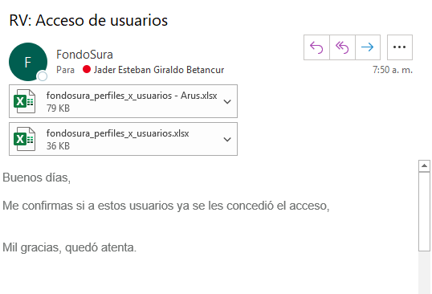
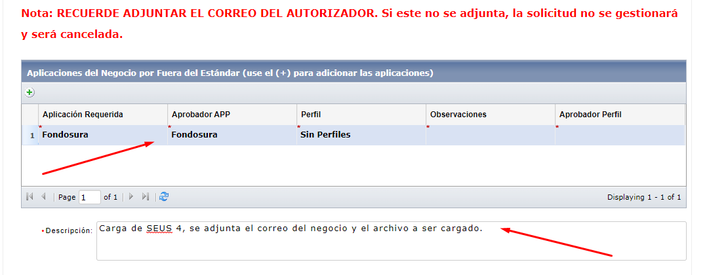
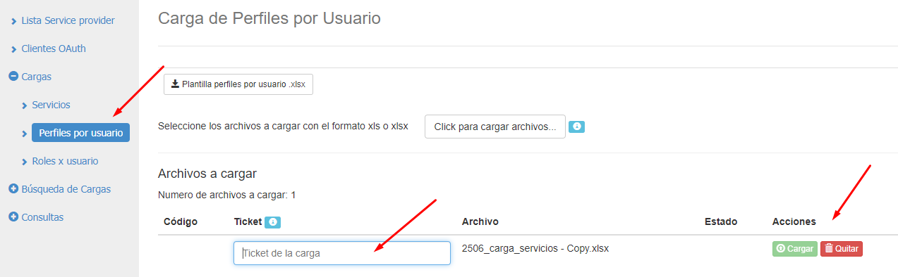
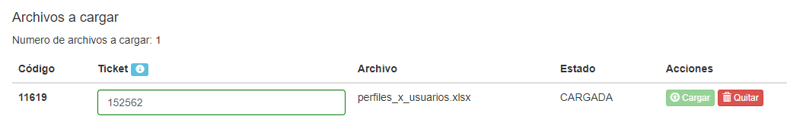

# Permisos para Fondosura

> **Fuente Confluence:** [Permisos para Fondosura](https://segurosti.atlassian.net/wiki/spaces/EPA/pages/560103967)
> **Última modificación:** 2022-09-27 — Miguel Ángel Colorado Restrepo · versión 7
> **Sección:** [Documentación de Solicitudes](./index.md)

<!-- -->

> **Info — Proceso de negocio**
> Perfilación de usuarios en Fondosura.

El sitio del fondo de empleados (Fondosura) necesita una perfilación para poder que los usuarios ingresen a la plataforma. Para esto es necesario darle un perfil en `SEUS 4`.
Estos perfiles se hacen a través de la carga de perfiles de la consola de `SEUS 4`, pero para poder hacer la carga es necesario crear un número de ticket en el catálogo de servicio.

## El proceso es el siguiente

1. El negocio manda la lista de usuarios a cargar. Por lo general mandan dos Excel, uno con los empleados y otros con los afiliados de ARUS.

    

2. Juntar los usuarios que envían en un solo archivo; es decir, si mandan dos Excel se debe unir para solo tener un archivo.

3. Guardar el mensaje de correo como prueba de la autorización del negocio (más adelante se debe adjuntar al Catálogo).

4. Abrir el Catálogo de Servicios e ir a la opción: `Aplicaciones de negocio / Servicios de TI / Cargas Masivas`.

5. Se selecciona la aplicación, se adjunta el correo de autorización y el archivo de Excel con una nota que diga que se carga el correo con la autorización del negocio y el archivo a ser cargado en `SEUS 4`.

    

6. Guardar el ID del ticket que arroja el Catálogo.

7. Abrir la consola de SEUS (<https://seus.suranet.com/>) e ir a la opción: `Cargas / Perfiles de usuario`.

8. Cargar el Excel con los usuarios y pegar el código del catálogo en la opción que aparece; luego dar al botón verde **Cargar**.

    

9. Revisar los errores que puede arrojar la consola y repararlos. Si la carga termina bien, notificar al negocio que los usuarios fueron cargados y que se les avisará cuándo, desde `SEUS 4`, el requerimiento haya sido finalizado (llega un correo notificando que los usuarios del Excel fueron cargados).

10. Finaliza el proceso si el estado dice que fue cargada.

    

```sql
```

> **Advertencia — Notas**
>
> - Si un usuario tiene problemas en la carga de `SEUS 4`, revisar que no sea un espacio en blanco en el nombre del usuario.
> - Si un usuario tiene problemas y no se sabe por qué, se elimina del Excel y se vuelve a probar; también se le notifica al negocio que ese usuario no pudo ser cargado.
> - El AD de ARUS cambia mucho de nombre; el actual es `AD ARUS`, pero puede ser cambiado a futuro. Si cambia, también debe ser cambiado en el Excel.
