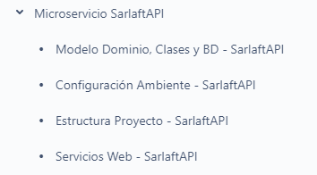

# Documentación Confluence

> **Fuente Confluence:** [Documentación Confluence](https://segurosti.atlassian.net/wiki/spaces/EPA/pages/1813545213/Documentaci%C3%B3n+Confluence)
> **Última modificación:** 2021-03-26 — Diana Muñoz · versión 2
> **Sección:** [Atributos de Calidad Desarrollo](./index.md)

Es muy importante documentar en este espacio de trabajo de Sarlaft 4.0, todos los componentes nuevos que  se desarrollen, incluyendo su diseño y arquitectura, configuración de ambiente, estructura del proyecto, servicios web expuestos, mecanismos de integración y demás items importantes. Por ejemplo:

Para cuando el desarrollo corresponda a un nuevo servicio web, por favor adicionar una pagina nueva al item de ***Servicios Web*** (correspondiente al modulo donde se desarrollo), e incluir los siguientes datos básicos: (La idea es hacer una descripción pequeña pero importante, dado que la documentación especifica estará en el swagger del proyecto)

- Objetivo del Servicio Web
- Endpoint
- Perfil de Seus4
- Ejemplo Json Request
- Dependencias: por ejemplo
  - Si tiene dependencia con servicios web externos, poner las url.
  - Si la dependencia es con base de datos, mencionar cual es la base de datos
  - Si la dependencia es con mensajería, poner el json de mensaje solicitado y recibido.
