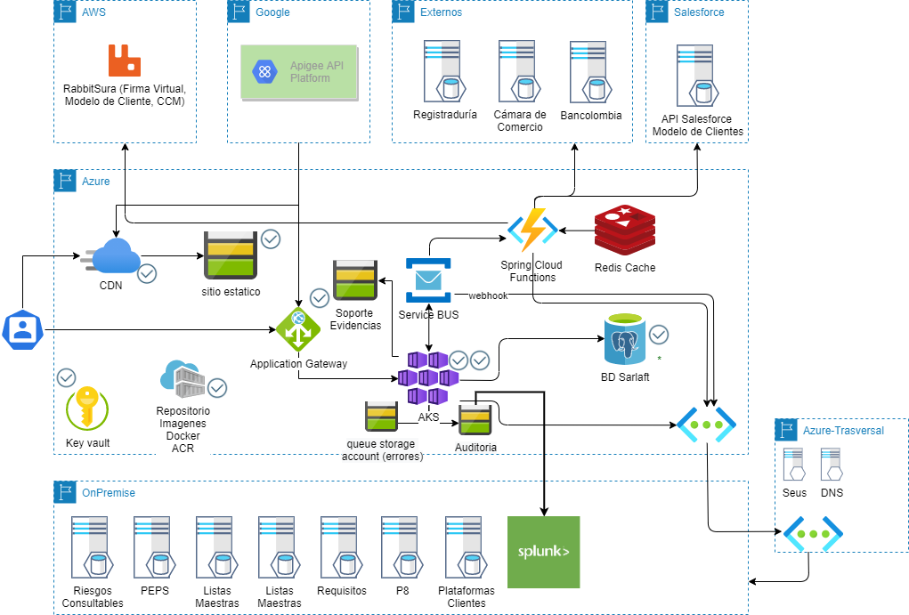

# Diagramas de Arquitectura

> **Fuente Confluence:** [Diagramas de Arquitectura](https://segurosti.atlassian.net/wiki/spaces/EPA/pages/1804861588)  
> **Última modificación:** 2021-04-05 — Jhon Edison Mesa Bedoya · versión 3  
> **Sección:** [Diseño - Arquitectura](./index.md)

Arquitectura de la aplicación, en la sección de Documento Técnico se puede encontrar una explicación del presente diagrama, así como en la sección de Contextualización la explicación de la misma a través de un video.

