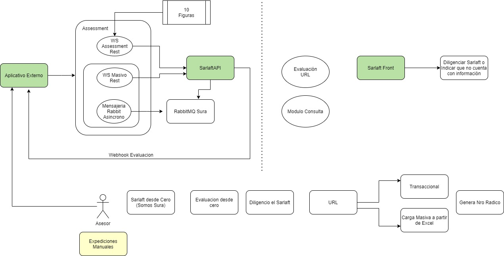

# 2. Entradas a Evaluación (Assessment)

> **Fuente Confluence:** [2. Entradas a Evaluación (Assessment)](https://segurosti.atlassian.net/wiki/spaces/EPA/pages/3213164787)
> **Última modificación:** 2023-06-06 — Diana Muñoz · versión 1
> **Sección:** [Diseño Funcionalidades](./index.md)

Esta sección tiene como objetivo explicar las posibles opciones por las cuales se puede crear una evaluación Sarlaft 4.0.

Concentrándonos solo en la entrada al proceso de evaluación de Sarlaft 4.0 tenemos las siguientes opciones:

1. **Servicio rest (assessment):** Este servicio recibe información de: tomador (obligatorio), figuras como beneficiario, asegurado, afiliado, datos básicos del negocio o póliza. Permite crear una evaluación para negocios de hasta 10 figuras y de forma transaccional, no apto para procesos masivos. Este servicio retorna inmediatamente el numero de evaluación creado, estado de la evaluación, estado de cada uno de los sarlaft con los controles que han sido levantados (control peps, registraduría, rrcc, gafi o identidad). [Servicio Evaluación Validación Sarlaft](https://segurosti.atlassian.net/wiki/spaces/EPA/pages/1814233305/Servicio+Evaluaci+n+Validaci+n+Sarlaft)

2. **Servicio rest masivo:** Este servicio permite recibir la misma información del servicio de assessment pero con un limite de 100 pólizas. La información es recibida como un payload y no devuelve ningún tipo de información de las evaluaciones creadas. [Servicio Proceso Masivo](https://segurosti.atlassian.net/wiki/spaces/EPA/pages/2093350926/Servicio+Proceso+Masivo). Explicacion del proceso masivo: [Interfaz Procesos Masivos](https://segurosti.atlassian.net/wiki/spaces/EPA/pages/1955070163/Interfaz+Procesos+Masivos). Para estas evaluaciones es creado una notificación de tipo webhook hacia el aplicativo cliente donde se indica el el numero de evaluación creado, estado de la evaluación, estado de cada uno de los sarlaft con los controles que han sido levantados (control peps, registraduría, rrcc, gafi o identidad), esta notificación no necesariamente indica que la evaluación haya finalizado, solo indica que se ha creado y se devuelve la misma información que devuelve el servicio rest de assessment.

3. **Mensajeria Rabbit Asincrono:** Esta opción permite recibir solicitudes de crear evaluación por medio de RabbitMQ, permite recibir la misma información del servicio de assessment pero con un limite de 100 pólizas. [Interfaz Procesos Masivos](https://segurosti.atlassian.net/wiki/spaces/EPA/pages/1955070163/Interfaz+Procesos+Masivos) Para estas evaluaciones es creado una notificación de tipo webhook hacia el aplicativo cliente donde se indica el el numero de evaluación creado, estado de la evaluación, estado de cada uno de los sarlaft con los controles que han sido levantados (control peps, registraduría, rrcc, gafi o identidad), esta notificación no necesariamente indica que la evaluación haya finalizado, solo indica que se ha creado y se devuelve la misma información que devuelve el servicio rest de assessment.

4. **Sarlaft Manual:** Opción presentada desde un formulario habilitado en Somos Sura, desde la cual se puede crear una evaluación directamente por un asesor o auxiliar de negocio, en este formulario se solicita la misma información que se ingresa en el servicio de assessment. Después de crear la evaluación al cliente se presenta un numero de radicado. Algunos aplicativos de negocio reciben este numero de radicado (opción poco usada) y consumen el servicio web de validación de radicado, para validar si la información con la cual se creo la evaluación es la misma con la que quiere expedir el negocio; de tener una respuesta positiva el aplicativo de negocio podra expedir el negocio, en caso contrario no podrá. [Servicio Validacion Radicado](https://segurosti.atlassian.net/wiki/spaces/EPA/pages/2619802061/Servicio+Validacion+Radicado)
