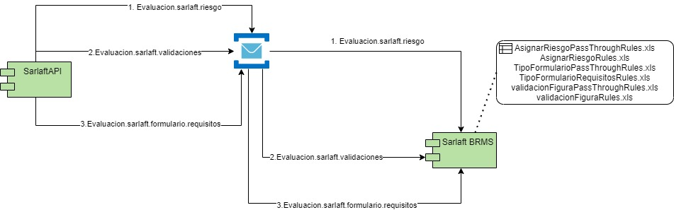
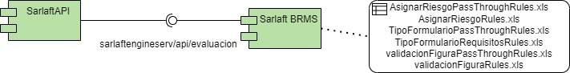

# 4. Comunicación con el motor (assessment)

> **Fuente Confluence:** [4. Comunicación con el motor (assessment)](https://segurosti.atlassian.net/wiki/spaces/EPA/pages/3222274070)
> **Última modificación:** 2023-10-06 — Diana Muñoz · versión 4
> **Sección:** [Diseño Funcionalidades](./index.md)

Durante el proceso de evaluación es necesario comunicarse con el motor en 3 ocasiones para determinar el riesgo, identificar validaciones y determinar el tipo de formulario (incluyendo los requisitos que se deben solicitar al cliente).

### Determinación de Riesgo:

El evento se origina en la clase `PrepararEvaluacion` a través del adaptador `MotorGateway` (`calculate`), este utiliza el query `Evaluacion.sarlaft.riesgo` con el cual obtiene el tipo de riesgo de cada uno de los sarlafts dentro de la evaluación.

### Identificar Validaciones:

El evento se origina en la clase `PrepararEvaluacion` a través del adaptador `MotorGateway` (`getValidaciones`), este utiliza el query `Evaluacion.sarlaft.validaciones` con el cual obtiene los tipos de validaciones que aplican a cada sarlaft dentro de la evaluación.

### Determinar Formulario:

El evento se origina en la clase `PrepararEvaluacion` a través del adaptador `MotorGateway` (`getTipoFormulario`), este utiliza el query `Evaluacion.sarlaft.formulario.requisitos` con el cual obtiene el tipo de formulario que aplica a la evaluación y cada unos de los requisitos que aplica a cada uno de los sarlafts de la evaluación.

Las funcionalidades descritas anteriormente, centralizadas en el uso de azure service bus como medio de comunicación, son reemplazadas por un único punto de integración, el cual corresponde a un servicio web, que se consume de forma reactiva y evidencio mejor desempeño en pruebas de carga transaccionales y masivas. La comunicación por medio de request replay entre el motor y sarlaftapi sigue presente en el código pero no se utilizara.

