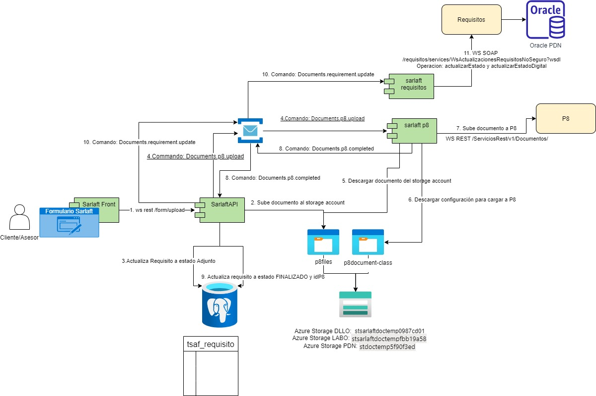

# 11. Requisitos de Sarlaft

> **Fuente Confluence:** [11. Requisitos de Sarlaft](https://segurosti.atlassian.net/wiki/spaces/EPA/pages/3228303479)
> **Última modificación:** 2023-06-21 — Diana Muñoz · versión 3
> **Sección:** [Diseño Funcionalidades](./index.md)

Un requisito en sarlaft corresponde a un documento que debe adjuntar el cliente en su formulario de sarlaft, estos documentos aplican según el nivel de riesgo del sarlaft y el tipo de persona (Natural o Jurídica) del cliente. La decisión de cuales requisitos se deben solicitar en un sarlaft es tomada por el análisis del Motor a través del query: ***Evaluacion.sarlaft.formulario.requisitos*** al momento de crear la evaluación, también se identifican al momento de agregar una figura o recategorizar el sarlaft.

## Tipos de requisitos:

Definidos en la tabla `sarlaft.tsaf_tipo_requisito`

| Código Requisito | Nombre | Tipo de Persona | Se sincroniza con el aplicativo de Requisitos |
| :---: | --- | :---: | :---: |
| 2303 | Certificado de Existencia y Representación Legal | Jurídica | SI |
| 2037 | Estados Financieros | Jurídica | SI |
| 2305 | Certificado de ingresos y retenciones | Natural | SI |
| 2307 | Copia de la declaración de renta del ultimo periodo gravable | Natural | SI |
| 828 | Documento apoderado | Natural | NO |

### Creación del Requisito:

En el momento de creación de la evaluación, agregar una figura a la evaluación o recategorización de la misma, se evalúa los requisitos requeridos por tipo de riesgo y figura por medio del query: ***Evaluacion.sarlaft.formulario.requisitos*** hacia el motor. Con el listado de requisitos se crea por cada uno de ellos un registro en la tabla `sarlaft.tsaf_requisito` en estado PENDIENTE asociado al sarlaft correspondiente. Por cada requisito creado en base de datos se emite el comando ***Documents.requirement.insert***, este comando es recibido por el microintegrador de sarlaft requisitos, el cual se encarga de consumir el servicio web de ActualizarRequisitos operacion insertarRequisitoCliente, de esta forma el requisito es creado para el cliente en el modelo de requisitos de la compañía.

### Adjuntar un Requisitos:

Es posible adjuntar un requisito por medio del formulario de Sarlaft 4.0, este utiliza el servicio rest ***/form/upload*** del microservicio Sarlaft API. Una vez recibido el documento soporte al requisito es subido al storage account al contenedor p8files y se actualiza el registro en base de datos en la tabla `sarlaft.tsaf_requisito` en estado ADJUNTADO. El documento no permanece en el sistema de sarlaft si no que debe ser almacenado en el gestor documental oficial de la compañía llamado P8, para esto el sarlaftapi emite el comando ***Documents.p8.upload***. Este comando es atendido por el microintegrador de sarlaft p8, el cual descarga el documento del contenedor p8files y lo sube a P8 a través del servicio rest post ***/ServiciosRest/v1/Documentos/***. Una vez P8 sube el documento el microintegrador de sarlaft p8 emite el comando Documents.p8.completed enviando el identificado de P8 para el documento, este es recibido por sarlaft api y actualizado en la tabla de `sarlaft.tsaf_requisito`, cambiando también el estado del requisito a FINALIZADO.

Si en ese momento identifica que el campo `dsestado_apprequisito` de la tabla `sarlaft.tsaf_requisito` se encuentra en estado INSERTADO lanza el comando ***Documents.p8.upload***, por medio del cual se actualiza el estado e identificador de P8 en el aplicativo de requisitos de Sura.

