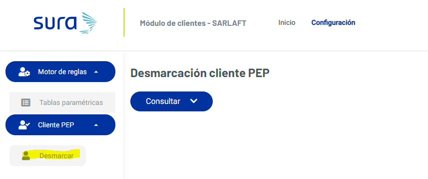
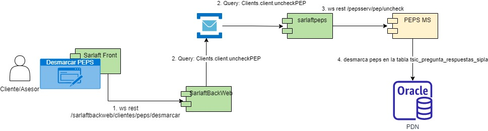

# 17. Desmarcar cliente PEPS

> **Fuente Confluence:** [17. Desmarcar cliente PEPS](https://segurosti.atlassian.net/wiki/spaces/EPA/pages/3236888621)
> **Última modificación:** 2023-06-23 — Diana Muñoz · versión 1
> **Sección:** [Diseño Funcionalidades](./index.md)

La demarcación de clientes Peps se realiza por medio del modulo de configuración Cliente PEP - Desmarcar.

Esta opcion utiliza el servicio web rest `/sarlaftbackweb/clientes/peps/desmarcar` del microservicio de sarlaft backweb, el cual por medio del microintegrador de peps consume el servicio web rest `/pepsserv/pep/uncheck` del microservicio PEPS que realiza la desmarcacion en la tabla de base de datos de oracle: `tsic_pregunta_respuestas_sipla`.

