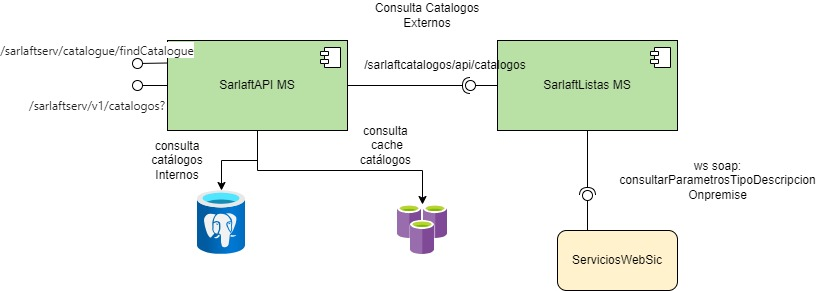

# 18. Consultar Catálogos

> **Fuente Confluence:** [18. Consultar Catálogos](https://segurosti.atlassian.net/wiki/spaces/EPA/pages/3675586561)
> **Última modificación:** 2024-04-16 — Diana Muñoz · versión 3
> **Sección:** [Diseño Funcionalidades](./index.md)

La consulta de los catálogos del aplicativo se realiza según el tipo de catalogo:

***Catalogo Interno:*** son aquellos catálogos que son administrados por sarlaft 4.0 para su uso interno. Estos catálogos se obtienen de las tablas `tsaf_catalogo` y `tsaf_parametro`. Antes de hacer la consulta a base de datos, estos son consultados en la cache.

`TIPO_PERSONA`, `COD_RAMOS`, `COD_SUBRAMOS`, `TIPO_EVIDENCIA`, `TIPO_DIRECCION_PN`, `TIPO_DIRECCION_PJ`, `CANALES`, `TIPO_PROPIETARIO`, `TIPO_NEGOCIO`, `TIPO_RELACION`, `PARENTESCO_PN`, `TIPO_COASEGURO`, `RELACIONES`, `PARENTESCO_PJ`, `OPERACION`, `RESULTADO_EVIDENCIA`, `TIPO_RIESGO`, `TIPO_FORMULARIO`, `TIPO_ENTIDAD`, `TIPO_FIGURA`, `TIPO_REQUISITO`.

***Catalogo Externo:*** son aquellos catálogos que son administrador por el gobierno de accesos y clientes. Estos catálogos se obtienen del servicio web externo `consultarParametrosTipoDescripcion` de ServiciosWebSic, para esto se utiliza el microintegrador SarlaftListas.

Los catálogos se cargan a cache para no acceder siempre al servicio web, para esto se tienen las siguientes premisas que se deben cumplir antes de consultar el servicio web externo:

- Los catálogos en cache no tienen fecha de vencimiento.
- Al obtener un catalogo de la cache se valida si este lleva mas de 5 días de creación en la cache, si es así, se intenta obtener el catalogo del servicio web externo, si el consumo es correcto, se actualiza la cache con la respuesta del servicio web para el catalogo buscado. Si por el contrario ocurrió un error o no fue posible obtener un valor valido, se deja la cache como esta y se devuelve el valor encontrado allí.
- No se almacena en la cache catálogos sin ninguna lista de valores asociados.

`DEPARTAMENTOS`, `TIPOSDOCUMENTOS`, `CIUDADESDPTO`, `PAISES`, `ACTIVIDADESECO`, `RANGOSINGRESOSNATJUR`, `OCUPACIONESCLIENTE`

Documentación interna:

[Servicio Web - Catálogos](https://segurosti.atlassian.net/wiki/spaces/EPA/pages/3387031595)
