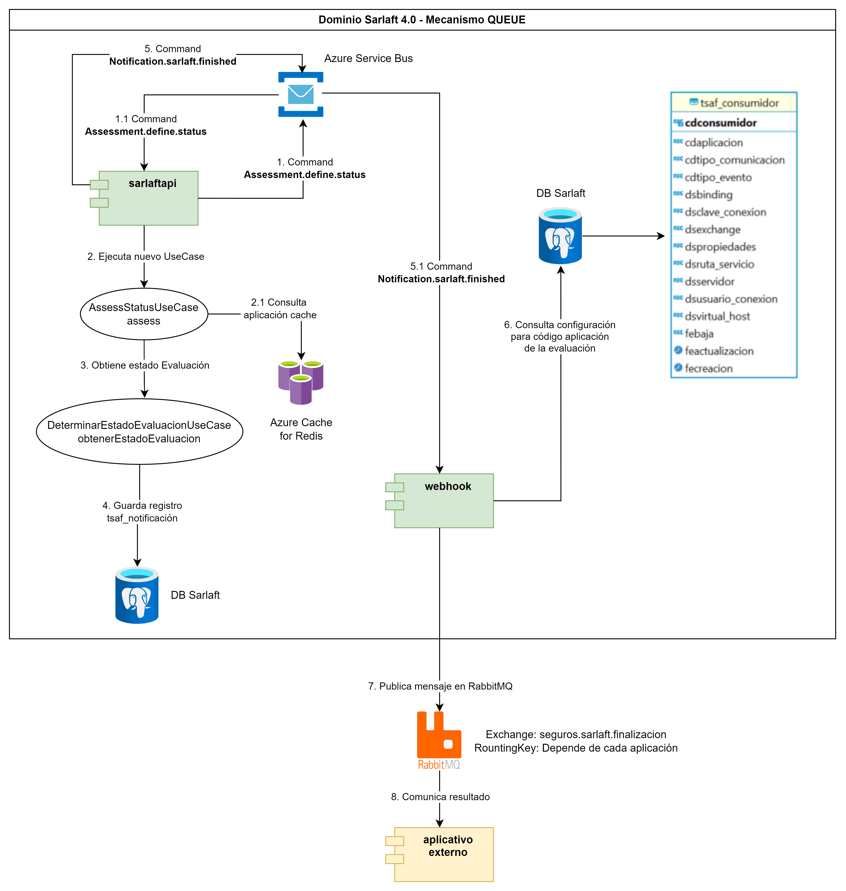
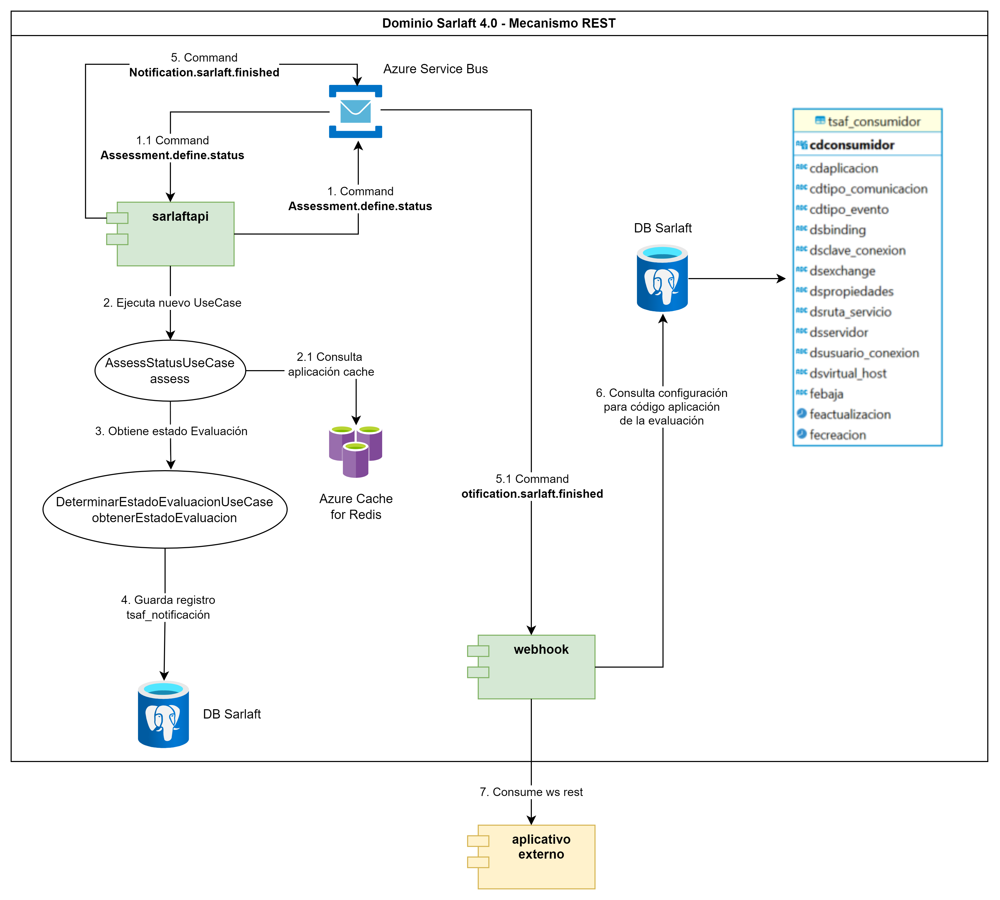
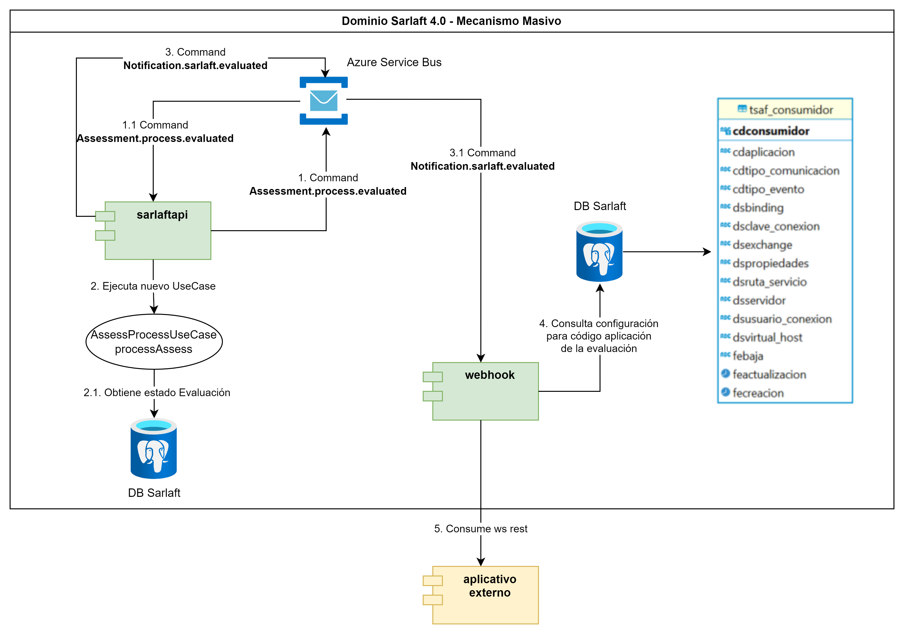

# Propuesta 2 - Mantener la comunicación por el Azure Service Bus

> **Fuente Confluence:** [Propuesta 2 - Mantener la comunicación por el Azure Service Bus](https://segurosti.atlassian.net/wiki/spaces/EPA/pages/3743580178)
> **Última modificación:** 2024-05-15 — Julián Andrés Curubo García · versión 3
> **Sección:** [Simplificar arquitectura de comunicación en proceso webhook - propuesta de cambio](./index.md)

En esta segunda propuesta se busca mantener la comunicación a través del Azure Service Bus, lanzando comandos provenientes de `sarlaftapi`, pasando por el Azure Service Bus y que escucharía nuevamente el microservicio `sarlaftapi`.

## **Diseño del nuevo proceso de webhook, interacción de componentes, cambio de comunicaciones de mensajería tipo Query a comunicación por servicio rest.**

### **Webhook de finalización**

#### **Comunicación a través del mecanismo de QUEUE:**

##### **Comunicación a través del mecanismo de REST:**

Para este mecanismo al eliminar el microservicio `sarlaftwebhook`, se propone:

- Mantener en el microservicio `sarlaftapi` la comunicación por el comando `Assessment.define.status`.
- Implementar en el microservicio `sarlaftapi` que escuche el comando `Assessment.define.status`.
- Implementar en el microservicio `sarlaftapi` un caso de uso llamado `AssessStatusUseCase#assess` como el que se viene manejando en el microservicio de `sarlaftwebhook` con el fin de que ahora sea `sarlaftapi` el que se encargue de buscar la información de la aplicación en el Azure Cache de Redis o, en su defecto, en la base de datos del aplicativo sarlaft 4.0 si no la encuentra en caché, con el fin de determinar si se deben aplicar notificaciones. En caso de que la aplicación esté parametrizada para recibir notificaciones, se valida que el estado de la evaluación que se encuentra en flujo corresponda a alguno de los siguientes estados: `FINALIZADO`, `RECHAZADO`, `PENDIENTE_ACCION_MANUAL`, `FINALIZADO_EXCEPCION`, `FINALIZADO_SIN_CARGA`. Si el estado de la evaluación coincide con alguno de los mencionados anteriormente, se registra un evento en la tabla `tsaf_notificacion` y se lanza el comando `Notification.sarlaft.finished`, el cual es recibido por el microservicio integrador webhook.
- Implementar el comando `Notification.sarlaft.finished` en el microservicio `sarlaftapi` (como actualmente se maneja en `sarlaftwebhook`) para enviarse desde `sarlaftapi` y así comunicarse con el microservicio integrador `sarlaftwebhook mi`.
- Se eliminaría la comunicación por query para `Evaluation.status.calculate` ya que se tomaría directamente desde `sarlaftapi` donde está implementado.

#### **Webhook de evaluación**

##### **Comunicación a través del mecanismo masivo:**

Para este mecanismo al eliminar el microservicio `sarlaftwebhook`, se propone:

- Mantener la comunicación por comando `Assessment.process.evaluated` en `sura.sarlaft4.reactive.adapter.notificacion.NotificacionAsynpter`.
- Implementar en el microservicio `sarlaftapi` que escuche el comando `Assessment.process.evaluated`.
- Implementar en el microservicio `sarlaftapi` el caso de uso `AssessProcessUseCase#processAssess`, similar al que se maneja en el microservicio `sarlaftwebhook`. Este caso de uso se encarga de consultar el estado de cada una de las evaluaciones recibidas en la lista de evaluaciones del objeto `EvaluacionMasiva` en la base de datos de sarlaft 4.0. Finalmente, construye el objeto `NotificacionEvaluacionNegocio` el cual se lanza por el comando `Notification.sarlaft.evaluated`, que es recibido por el microservicio integrador webhook.

Implementar el comando `Notification.sarlaft.evaluated` para enviarse desde `sarlaftapi` y así comunicarse con el microservicio `sarlaftwebhook mi`.

#### **Identificación de los puntos a mejorar y riesgos con la aplicación del cambio**

**Mejoras:**

- Eliminar el punto de fallo del microservicio de `sarlaftwebhook`.
- Eliminar el cuello de botella de atender el query por parte del microservicio de `sarlaftapi`.
- Al mantener la comunicación por el Azure Service Bus se conservaría:

Gestión de los mensajes en el dead letter queue.\
Trazabilidad de los mensajes y eventos.\
Gestión de los mensajes: consulta, filtrado, estadísticas.\
Garantía de Entrega de los mensajes.\
Persistencia de Mensajes: los mensajes se almacenan de manera duradera, asegurando que no se pierdan y puedan ser recuperados y procesados posteriormente.\
Autoescalado: manejo automático del aumento de la carga de trabajo sin intervención manual.

- Los cambios realizados en el microservicio de `sarlaftapi` no requerirían pruebas de seguridad dinámicas lo cual elimina la espera que implica que sean programadas.

**Riesgos y contras:**

- Transferir la responsabilidad que venía manejando el microservicio `sarlaftwebhook` al microservicio `sarlaftapi`.
- Se deben realizar varios cambios a nivel de programación en el microservicio `sarlaftapi`.
- Aumenta la complejidad accidental en el microservicio de `sarlaftapi`.
- Los cambios que se deben realizar en el microservicio `sarlaftapi` aplica para pruebas de seguridad estáticas por checkmarx.
- Al mantener la comunicación a través del Azure Service Bus se mantendría:

Gastos operativos\
Tarifas de Transferencia de Datos\
Retardo en la Entrega de los mensajes\
Dependencia con la Red cuando se presente conectividad limitada o inestable

- Al mantener la comunicación por el Azure Service Bus se podría presentar el problema con el tamaño máximo de los mensajes.

Debido a que el microservicio `sarlaftapi` emitirá comandos que a su vez serán recibidos por él y debido a que ahora en `sarlaftapi` asumirá toda la transaccionalidad que se venía manejando en el microservicio `sarlaftwebhook`, se pronostica un encolamiento de mensajes en el Azure Service Bus.
