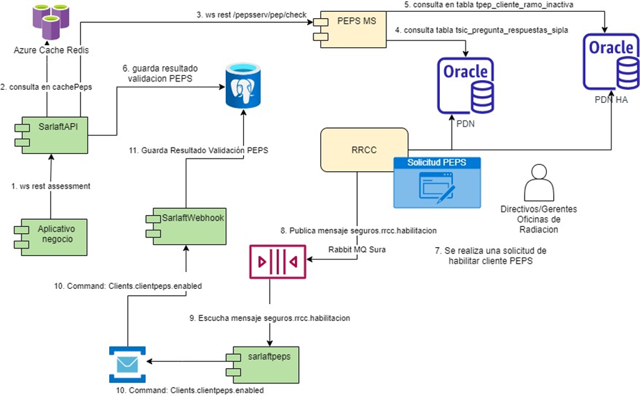
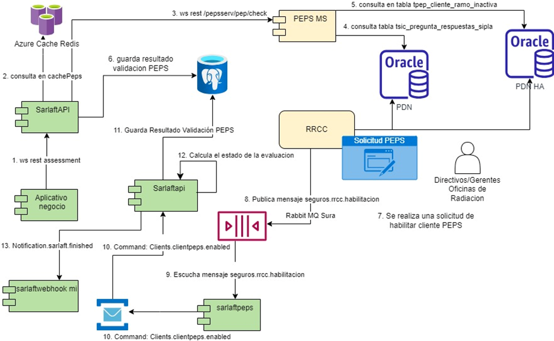

# Validación y Habilitación Cliente PEPs - propuesta de cambio

> **Fuente Confluence:** [Validación y Habilitación Cliente PEPs - propuesta de cambio](https://segurosti.atlassian.net/wiki/spaces/EPA/pages/3648421917)
> **Última modificación:** 2024-04-04 — Diana Muñoz · versión 2
> **Sección:** [Diseño Funcionalidades](./index.md)

Diagrama del estado actual de levantamiento de Control PEPS

En este esquema el microservicio de SaralftWebhook se encarga de recibir el comando `Clients.clientpeps.enabled`, busca las evidencias PEPS en estado fallido relacionadas con el cliente habilitado y actualiza el estado a EXITOSO, posteriormente consume el query: `Evaluation.status.calculate` para determina el nuevo estado de la evaluación. Si la evaluación queda en un estado final lanza el comando `Notification.sarlaft.finished`.

***1.Diseño del nuevo proceso de levantamiento de control PEPS, interacción de componentes, cambio de comunicaciones de mensajería tipo Query a comunicación por servicio rest.***

En el escenario de eliminar el microservicio de SaralftWebhook, se propone que el microservicio de Sarlaftapi reciba el comando `Clients.clientpeps.enabled` y realice los pasos siguientes que fueron descritos el párrafo anterior, cambiando el consumo de un query por utilizar la clase `DeterminarEstadoEvaluacionUseCase`.

Nuevo Diseño:

**Identificación de los puntos a mejorar y riesgos con la aplicación del cambio:**

Con el cambio la principal mejora es eliminar el punto de fallo del microservicio de sarlaftwebhook y eliminar el cuello de botella de atender el query por parte del microservicio de sarlaftapi.
