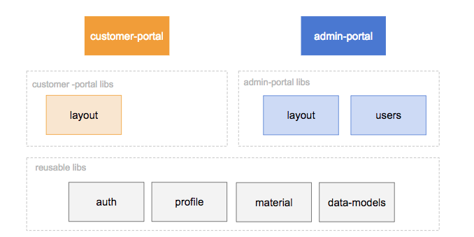
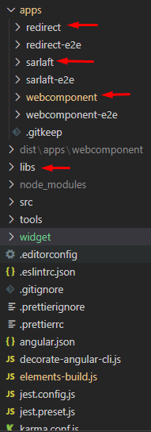
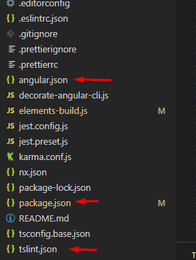

# Diseño MonoRepositorio.

> **Fuente Confluence:** [Diseño MonoRepositorio.](https://segurosti.atlassian.net/wiki/spaces/EPA/pages/2233073714)
> **Última modificación:** 2024-05-28 — Santiago Valencia Ochoa (Unlicensed) · versión 7
> **Sección:** [Front](./index.md)

El front de sarlaft esta construido usando un diseño orientado a monorepositorios.

El cual contiene las siguiente características:

**<u>Aplicaciones:</u>**

- **Redireccion**
  - Aplicación para llenar formulario de Sarlaft usando URL de redireccion la cual es lanzada desde los aplicativos clientes.
- **Webcomponent**
  - Aplicación de tipo webcomponent usando angular Elements
- **Admin**
  - Aplicación Administrativa para manejo de catálogos

**<u>Librerias:</u>**

Las librerías serán componentes (Directivas, Modulos, etc) transverzales que seran reutilizados por las apps: Ejemplo

- Api
- Control PEP
- Core
- Datos Beneficiarios
- etc

---

Tenemos el siguiente workspace:

Donde se cuenta con archivos únicos a nivel de configuración los cuales usan las diferentes apps del monorepositorio:

