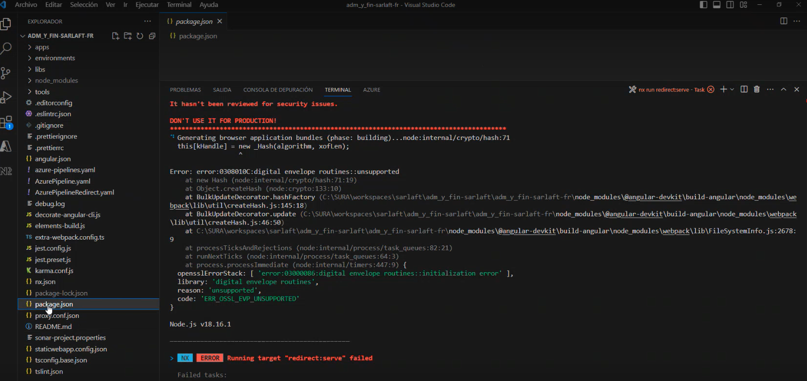

# error:0308010C:digital envelope routines::unsupported

> **Fuente Confluence:** [error:0308010C:digital envelope routines::unsupported](https://segurosti.atlassian.net/wiki/spaces/EPA/pages/3242819613)
> **Última modificación:** 2024-05-17 — Santiago Valencia Ochoa (Unlicensed) · versión 9
> **Sección:** [Errores](./index.md)

**Causa:**

- Este error se produce porque Node.js v17 o versiones posteriores usan OpenSSL v3.0, que tuvo cambios importantes, las cuales no son compatibles con la versión del Node.js, del Angular Cli y la versión del webpack definidos para la aplicación.

**Solución:**

1. Eliminar la carpeta local del proyecto para descontaminar el ambiente local
2. Desinstalar la versión actual de **Node.js** y de **Angular** de su maquina e instalar la versión [Node.js v16.16.0 (LTS)](https://nodejs.org/en/blog/release/v16.16.0). Instalar Angular es opcional ya que al ejecutar `npm install` en el directorio del proyecto se instala automáticamente la versión de Angular compatible.
3. Seguir nuevamente los pasos de configuración de ambiente: [Configuración ambiente](../ConfiguracionAmbiente/index.md)
