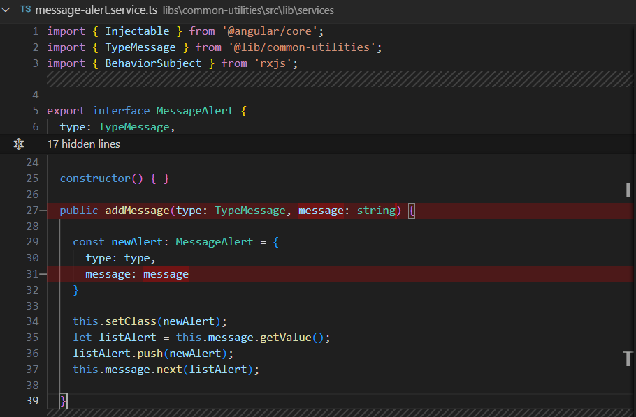
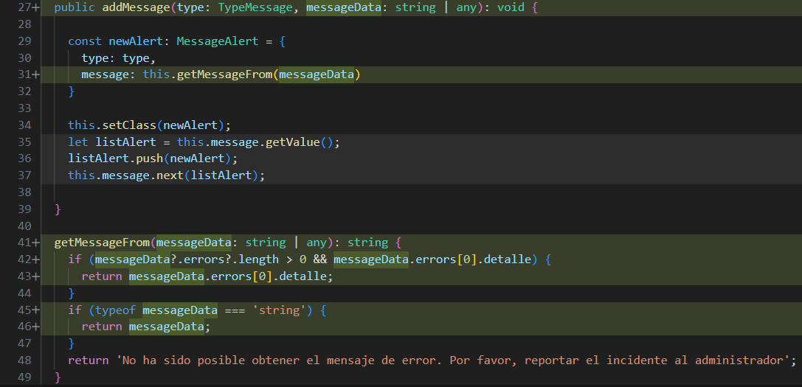

# Control Respuesta de Error en Mensajes

> **Fuente Confluence:** [Control Respuesta de Error en Mensajes](https://segurosti.atlassian.net/wiki/spaces/EPA/pages/4074242055/Control+Respuesta+de+Error+en+Mensajes)
> **Última modificación:** 2024-09-25 — Brayan Estiven Sepúlveda Quintero · versión 2
> **Sección:** [Front Sarlaft](./index.md)

Se ajusta el servicio de alertas que es transversal a los tres subproyectos de redirect, webcomponent y sarlaft del repositorio 892-sarlaft-fr. El cambio consiste en garantizar una adecuada lectura del mensaje de error que puede venir en diferentes formatos dependiendo del consumo de la api consumida. Esto se hace para garantizar la retrocompatibilidad del proyecto con el consumo de apis anteriores y nuevas cuando las mismas arrojan algún error.

A continuación se presenta el servicio antes de su modificación:

Y después de su modificación:

Como se aprecia en la imagen anterior el método getMessageFrom se encarga de obtener el mensaje según el tipo de dato que se le proporcione.
