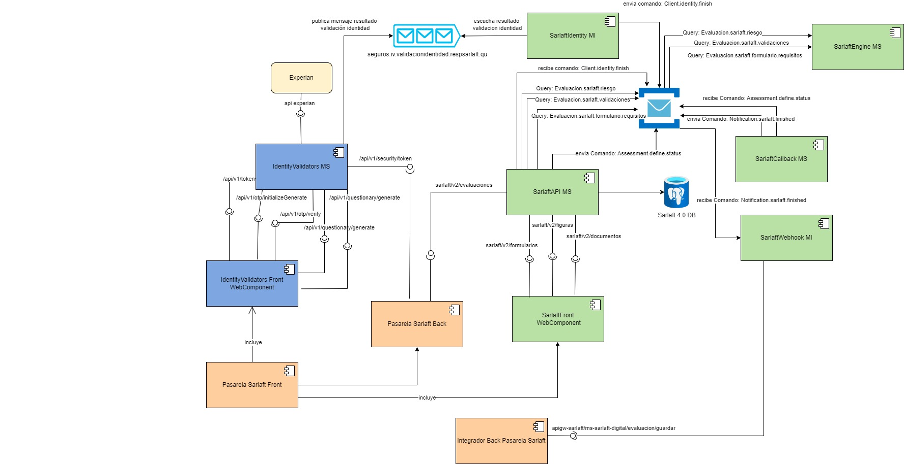

# Cambios integración SOAT en pasarela de Digital

> **Fuente Confluence:** [Cambios integración SOAT en pasarela de Digital](https://segurosti.atlassian.net/wiki/spaces/EPA/pages/3381592106/Cambios+integraci%C3%B3n+SOAT+en+pasarela+de+Digital)
> **Última modificación:** 2024-07-16 — 5c9be387203e134514cf87ce · versión 4
> **Sección:** [WebComponent](./index.md)

Con base en los requerimientos solicitados a Sarlaft por parte de SOAT se identifican los siguientes cambios en el aplicativo de Sarlaft 4.0 :

- **Permitir comunicar de forma adecuada los errores presentados en el proceso de sarlaft:** Para este punto se requiere realizar un ajuste al mapeo de códigos de respuesta del webcomponent de sarlaft, específicamente al código ERROR_API_CALL_METHOD, cambiando de la siguiente forma:

| **Código Respuesta** | |
| --- | --- |
| ERROR_API_CALL_METHOD | Error emitido cuando la API de Sarlaft devuelve un error por un mal request. |
| ERROR_BUSINESS | Error emitido cuando sarlaft identifica que el request enviado no cumple con una validación de formato en sus campos de entrada o de negocio en la transacción realizada. |
| ERROR_INTERNAL_NO_PROCESS | Error interno no controlado y se debe mostrar algún mensaje definido por el canal. |

Asociado al código de error en el campo messageError se pondrá la descripción del error recibida del api de sarlaft

Este cambio incluye crear nuevos endpoints para los servicios de sarlaft 4.0 (esto para evitar reprocesos en los demás aplicativos clientes del api) y dar la respuesta correspondiente a errores de formato, negocio y técnicos definidos en la siguiente pagina: [Respuestas de error (propuesta aun no implementada)](https://segurosti.atlassian.net/wiki/spaces/EPA/pages?title=Respuestas%20de%20error%20%28propuesta%20aun%20no%20implementada%29) teniendo en cuenta el excel indicado 
[respuestasErroresSarlaft4.xlsx](./attachments/respuestasErroresSarlaft4.xlsx)

Componentes afectados: sarlaftapi, sarlaftadmin, sarlaftbatch, webcomponent.

Servicios a modificar: 41 servicios web

**Permitir herencia de los sarlaft finalizados para evaluaciones del producto soat**: en este punto se requiere permitir que se aplique la vigencia de los sarlafts a las evaluaciones realizadas para negocios del ramo de SOAT, esto implica que los sarlafts en tipificación simplificada u ordinaria tendrán una vigencia de 3 años e intensificados 1 año.

Los sarlaft finalizados para persona natural al heredar se valida el estado de las evidencias y se deja solo en pendiente las de experian y por ende el sarlaft se pasa a pendiente para poder solicitar validación de identidad a través de la pasarela

Para persona jurídica siempre que no tenga validación de identidad propia se deja en pendiente el sarlaft y el formulario para que vuelva a solicitar los representante legal/ accionista y haga la herencia por separado de cada uno

Componentes afectados: sarlaftapi

Clase a modificar: PrepararEvaluacion

**Permitir identificar el motivo por el cual falla la validación de registraduría (fallecido o error en datos):**

Validar que en el campo codigoEstadoDocumento de la entidad Evidencia se este guardando el resultado del estado de documento en la validación de registraduría. Adicionar a la entidad Evidencia el campo cdRespuesta donde se almacene el resultado de la clasificación de validación de registraduría de acuerdo al siguiente lineamiento:

| **Código Respuesta Experian** | **Código Respuesta Sarlaft 4.0** | **Detalle** |
| --- | --- | --- |
| 06,09,1014 para tipos de identificación E,TT, TE | ERROR_DATOS | Los datos enviados para la validación en Experian fueron incorrectos y por esa razón fallo la validación de registraduría. |
| 00 | VIGENTE | Validación Exitosa |
| 21 | NO_VIGENTE | Asociado a identificaciones que aparecen con estado fallecido en la registraduría |
| 99 | EN_TRAMITE | |
| 12 | SUSPENDIDA | |
| 30 | NO_EXPEDIDA | |
| >60 | INDEFINIDO | |

Ajustar en el microservicio de sarlaftwebhookmi para adicionar el campo codigoRespuesta al objeto Control en el json enviado como resultado de webhook. Asociar a este campo del json el campo cdRespuesta de la entidad Evidencia.

Ajustar en el microservicio identityvalidatorms para que los códigos de estado de documento 06, 09 y 10 no sean mapeados como un Bad Request (httpmethod 400) si no que sean una respuesta de formato json, indicando el resultado obtenido.

Componentes afectados: sarlaftapi, sarlaftwebhookmi, identityvalidatorms

- **Crear reglas en el motor para que los corredores realicen validación de identidad: **cambio a realizar en el microservicio de sarlaftengine en reglas de drools.

Componentes afectados: sarlaftengine

- **Cuando la validación de identidad sea falla técnica entonces RECHAZAR la evaluación para soat: **cambio realizado en el microservicio de sarlaftapi en la clase DeterminarEstadoEvaluacionUseCase
  Se valida el estado de la evidencias de experian que sea falla tecnica y si la poliza de la evaluacion es de el codigo ramo de soat entonces la evaluacion pasa a rechazada

Componentes afectados: sarlaftapi.

- **Funcionalidad para parametrizar configuración de códigos de parametria experian: **en este cambio se brinda la posibilidad de que soat tenga al menos dos parametrias, para decidir cual código utilizar, se recibirá un nuevo parámetro de entrada en el webcomponent de validación de identidad, este código viajara hasta el microservicio del back para elegir cual código de parametria enviar al api de Experian.

Componentes afectados: identityvalidators wc, identityvalidators ms

