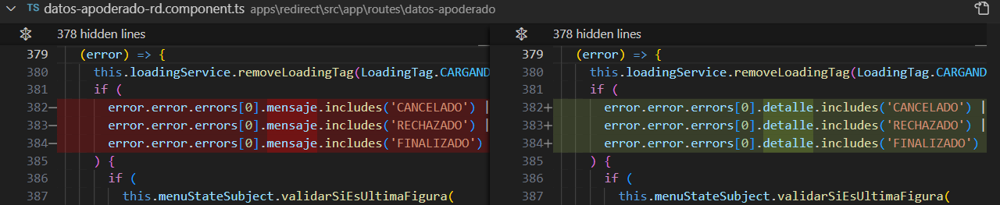
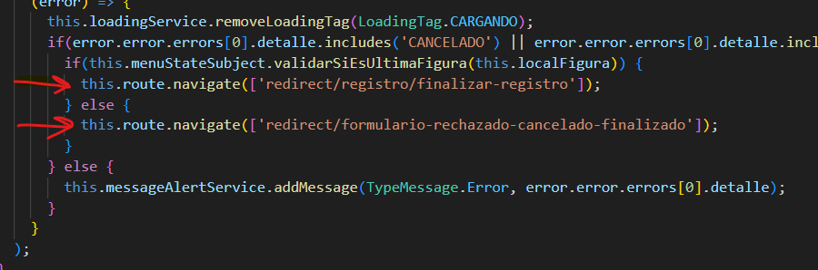

# Incidente Mensaje de Error

> **Fuente Confluence:** [Incidente Mensaje de Error](https://segurosti.atlassian.net/wiki/spaces/EPA/pages/4030791790/Incidente+Mensaje+de+Error)
> **Última modificación:** 2024-09-20 — Brayan Estiven Sepúlveda Quintero · versión 2
> **Sección:** [WebComponent](./index.md)

Actualmente para algunos componentes del proyecto 892-sarlaft-fr asociados al redirect y webcomponent, se hizo un ajuste para recibir correctamente el error con la nueva estructura del objeto Json proveniente de los nuevos endpoints solicitados en la HU505077. El ajuste se hizo debido al incidente 6509354 que fue reportado en PDN y que al indagar sobre el tema, se evidenció que al momento de guardar un formulario de algunas figuras y cuando se presentaba alguna excepción de negocio, no estaba apareciendo el mensaje del error que indicaba que algo salió mal y no se pudo guardar el formulario.

En la siguiente imagen se muestra como se obtiene el valor del mensaje a partir de la nueva estructura del objeto de error.

Para replicar el escenario se inyectó en laboratorio el error temporalmente al endpoint de v1/formularios de tipo PUT del proyecto 892-sarlaft-api-ms:

Con esto se garantiza que al crear una evaluación a la que se le deba agregar una figura y diligenciar el formulario, al momento de guardar el formulario fallara provocando un error.

Una vez se hizo el cambio mostrado en la primera imagen se logra mostrar el error al usuario.

El enlace a la historia técnica en azure es el siguiente por si se requiere ver a mayor profundidad el código desde el PR respectivo: [https://dev.azure.com/SuraColombia/Portafolios/_backlogs/backlog/mod-operativo_orden_administrativa_soat/Proyectos?workitem=619901](https://dev.azure.com/SuraColombia/Portafolios/_backlogs/backlog/mod-operativo_orden_administrativa_soat/Proyectos?workitem=619901)

Al hacer el ajuste se evidencio que había un bug debido a que no se estaba obteniendo el campo correcto del objeto de error, esto implico una nueva modificación en los siguientes componentes del redirect:

- DatosAfianzadosRdComponent
- DatosApoderadoRdComponent
- DatosAseguradosRdComponent
- DatosBeneficiariosRdComponent
- DatosDirectivosRdComponent
- DatosTomadorRdComponent
- ValIdentidadRcPageComponent

El cambio consistió en cambiar el acceso del atributo ***mensaje ***por el atributo ***detalle ***para cada uno de los componentes implicados, tal como se muestra en la imagen:

Al hacer el cambio, se consigue que se ejecute la respectiva redirección a un nuevo componente, esta lógica aplica para los componentes mencionados anteriormente, logrando así evitar que se muestre un mensaje de error al usuario a través de la ejecución del método ***this.messageAlertService.addMessage(TypeMessage.Error, error.error.errors[0].detalle);***

La historia de usuario del ajuste anterior es:[https://dev.azure.com/SuraColombia/Portafolios/_workitems/edit/630696](https://dev.azure.com/SuraColombia/Portafolios/_workitems/edit/630696)
