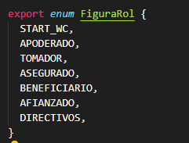
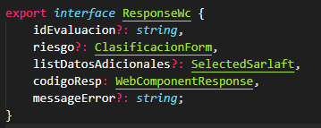

# Integración

> **Fuente Confluence:** [Integración](https://segurosti.atlassian.net/wiki/spaces/EPA/pages/2313945443/Integraci%C3%B3n)
> **Última modificación:** 2024-06-05 — 5c9be387203e134514cf87ce · versión 17
> **Sección:** [WebComponent](./index.md)

Se describen los pasos necesarios para conectarse a sarlaft usando el web component.

**Configuración en App Cliente.**

- **Nombre de Etiquieta:**
  ``
- **Parámetros de entrada:**

```
  @Input() token?: string;
  @Input() tenant?: string;
  @Input() app?: string;
  @Input() request?: string;
  @Input() rol: string;
  @Input() codigoflujo: string;
```

**Token: **Token Jwt de seguridad expuesto por la API. Ver: [Creación token JWT](https://segurosti.atlassian.net/wiki/spaces/EPA/pages?title=Creaci%C3%B3n%20token%20JWT) **Tenant:** typo Json, por definir estructura. Campo usado para manejo de estilos personalizados.**App**: Nombre de la aplicación cliente que esta consumiendo el web component. Esta debe ser exactamente la misma usada durante el consumo o solicitud del token.**Request:** Objeto de negocio que contiene la información requerida para pintar el webcomponent.**Rol:** Indica la figura o Rol que se debe pintar y que esta asociada a la información enviada en campo *Request*. **Tipos permitidos:**

- **Parámetros de Salida:**
  ` @Output() resultEvent = new EventEmitter();`
El Web Component durante la ejecución de procesos internos puede devolver los siguientes valores:

| **Código** | **Descripción** | **¿Que hacer?** | **Fecha de baja** |
| --- | --- | --- | --- |
| ERROR_SECURITY_INVALID_TOKEN | Error de Seguridad Token invalido | Generar un nuevo Token e invocar el WC nuevamente o mostrar mensaje definido por el canal | |
| ERROR_SECURITY_EXPIRED_TOKEN | Error de Seguridad Token expirado | Generar un nuevo Token e invocar el WC nuevamente o mostrar mensaje definido por el canal | |
| ERROR_INTERNAL_NO_PROCESS | Error Interno no controlado | Error interno y se debe mostrar algún mensaje definido por el canal. | |
| ERROR_API_CALL_METHOD | Error emitido cuando la API de Sarlaft no esta disponible o presenta fallas al momento de consumirla. | Por decisión se dejará de emitir este error y el WC mostrará una alerta indicadndole al usuario como proceder | 18/03/2022 |
| ERROR_POLITICS_SARLAFT | Error cuando se presenta una restricción por politicas de sarlaft (Fallo en los controles, por ejemplo GAFI - Pais de alto riesgo) | Por decisión se dejará de emitir este error y el WC mostrará un popup indicadndole al usuario como proceder | 18/03/2022 |
| SARLAFT_SAVE_SUCCESS | La información de Sarlaft se guardo correctamente | Se guardo la figura correctamente y se debe mostrar la siguiente figura del flujo. | |
| ERROR_SECURITY_INVALID_PARAM | Parámetros incorrectos enviados al webcomponent | Error interno y se debe mostrar algún mensaje definido por el canal. En caso de agregar nuevos campos al WC se debe realizar a través de demanda cruzada con reunión del cliente involucrado para realizar el cambio en ambas aplicaciones. Por ejemplo, se pidan nuevos datos para realizar la evaluación SARLAFT. | |
| SARLAFT_ASSESSMENT_FINISH | La evaluación de Sarlaft se encuentra finalizada, se puede continuar con el proceso. | La evaluación de Sarlaft se encuentra finalizada, se puede continuar con el proceso. | |
| SARLAFT_GETFORM_CANCEL | La evaluación de Sarlaft se encuentra cancelada. | La evaluación de Sarlaft se encuentra cancelada. Puede ser que una o todas las figuras se cancelan de la evaluación y se debe mostrar algún mensaje definido por el canal. | |
| SARLAFT_ASSESSMENT_REJECT | La evaluación de Sarlaft se encuentra rechazada, no se puede continuar con el proceso. | No se puede expedir. La evaluación de Sarlaft se encuentra rechazada, no se puede continuar con el proceso y se debe mostrar algún mensaje definido por el canal. | |
| SARLAFT_ASSESSMENT_PENDING | La evaluación de Sarlaft se encuentra pendiente por aprobación de alguna plataforma. | La evaluación de Sarlaft se encuentra pendiente por aprobación de alguna plataforma. Se debe pintar el formulario reportado (simplificado, ordinario o intensificado) | |
| SARLAFT_ASSESSMENT_PENDING_MANUAL_ACTION | La evaluación de Sarlaft se encuentra pendiente por aprobación manual. | La evaluación de Sarlaft se encuentra pendiente por que la evidencia de validación de identidad no se ha adjuntando. Esto aplica cuando el canal realiza la validación de identidad y debe adjuntar la evidencia en la evaluación SARLAFT. Por ahora, aplica para ordinario e intensificado (queda sujeto a cambios, si los hubiere) | |
| SARLAFT_GETFORM_FINISH_NO_LOAD | La evaluación de Sarlaft se encuentra finalizada, pero falta integrarse con Requisitos y P8. | La evaluación de Sarlaft se encuentra finalizada y puede continuar con la expedición del negocio, pero falta integrarse con Requisitos y P8. | |
| SARLAFT_ASSESSMENT_SUCCESS | La evaluación está pendiente por algún control (control de vinculación por cliente PEP, consulta con registraduría, entre otros) pero los formularios de las figuras reportadas están finalizados. | No se debe mostrar el formulario de las demás figuras y esperar la respuesta del webhook para evidenciar el estado final de la evaluación. La evaluación está pendiente por algún control (control de vinculación por cliente PEP, consulta con registraduría, entre otros) pero los formularios de las figuras reportadas están finalizados. | |

- **Implementación:**
  Para hacer el llamado al webcomponent se debe importar la libreria de sarlaft conforme a cada ambiente:`https://sarlaft.dllosura.com/webcomponent/sarlaft-webcomponent-main.js`
- `https://sarlaft.labsura.com/webcomponent/sarlaft-webcomponent-main.js`
- `https://sarlaft.sura.com/webcomponent/sarlaft-webcomponent-main.js`
una vez tengamos habilitada la librería, hacemos uso de la etiqueta **** que nos permitirá pintar el webcomponent:

```
    
```

Adicional debemos agregar los archivos asociados a los styles e imágenes de componente:

```
    
    
    
    
```
