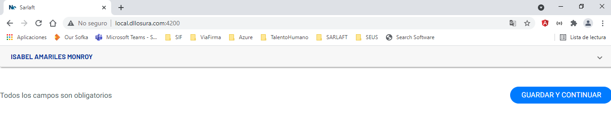
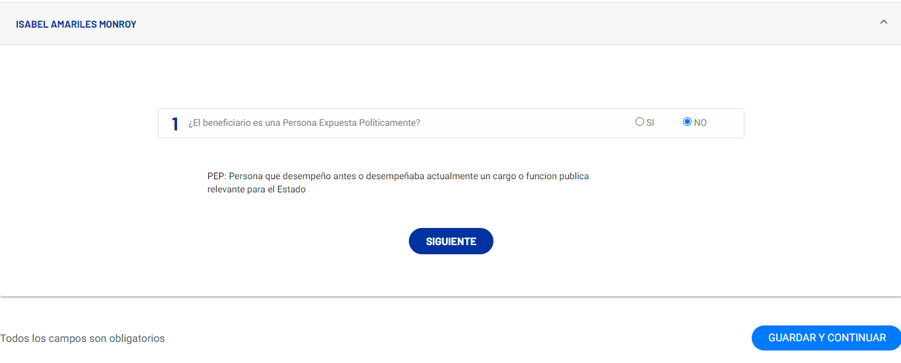
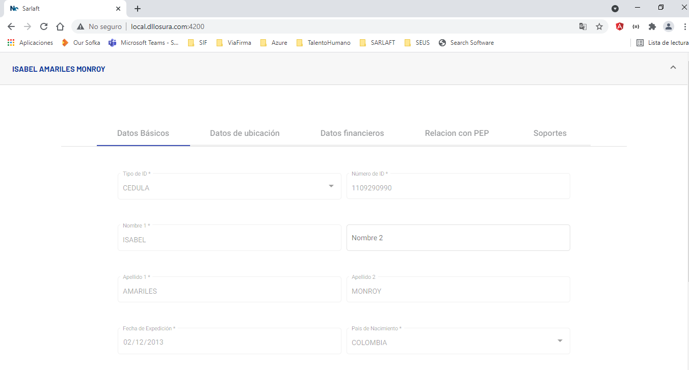
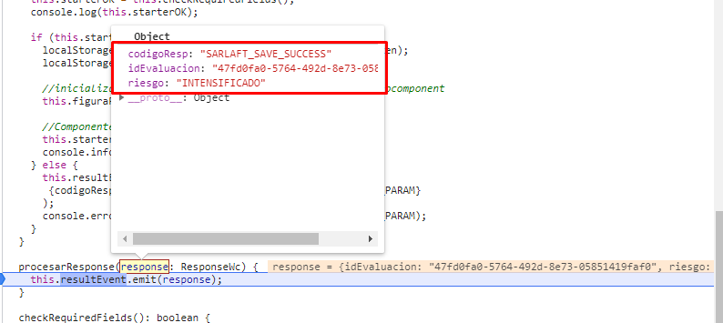
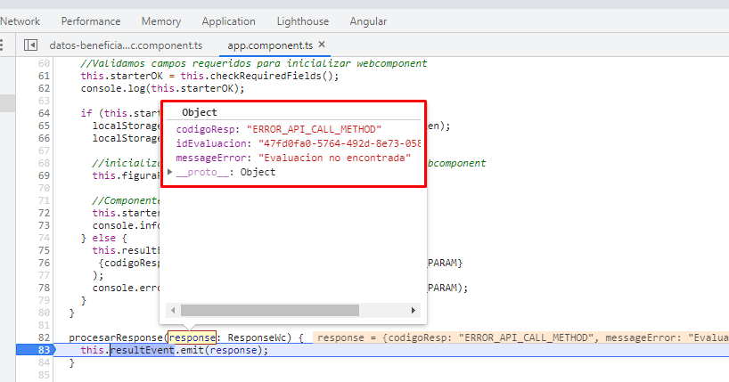

# Beneficiario vida y/o producto

> **Fuente Confluence:** [Beneficiario vida y/o producto](https://segurosti.atlassian.net/wiki/spaces/EPA/pages/2523660295/Beneficiario+vida+y/o+producto)
> **Última modificación:** 2021-12-06 — Deivid Harritson Urrego Carvajal · versión 1
> **Sección:** [Secciones (pantallas)](./index.md)

Para hacer uso del webcomponent en la sección de beneficiarios, se requieren los siguientes campos:

```
@Input() token: string (jwt);
@Input() app: string (aplicacion con la que fue creado el jwt); 
@Input() request: string; 
@Input() rol: string = 'BENEFICIARIO';
```

El campo request es de tipo string, sin embargo, este debe tener la forma de un JSON valido, con los siguientes campos

```
{
  idEvaluacion: string,
  sarlaft: Sarlaft[]
}
```

En donde el sarlaft, corresponde a la información se desea mostrar.

Al momento de completar el formulario se emitirá la siguiente información:

```
{ 
 idEvaluacion: string, 
 riesgo: ClasificacionForm, 
 codigoResp: WebComponentResponse, 
 messageError: string; 
}
```

El riesgo puede ser: SIMPLIFICADO, ORDINARIO O INTENSIFICADO.

El campo messageError: Solo se mostrará en caso de presentarse un error.

Los codigo de respuesta lo pueden encontrar en la sección [Integración](../Integracion.md)

