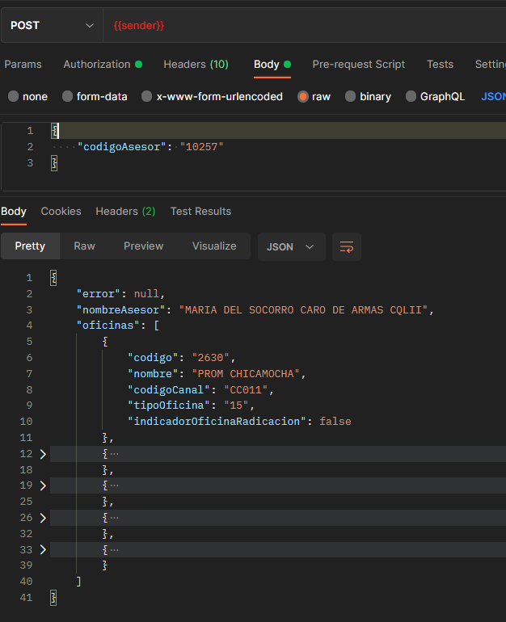
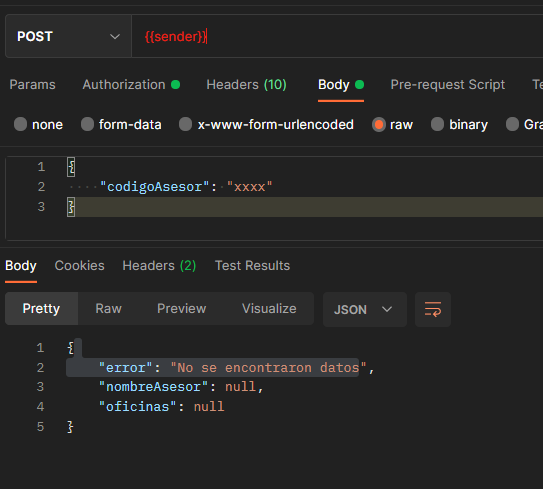
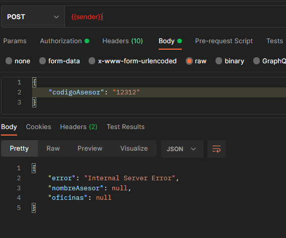

# Comunicación Servicio de oficinas asesor | redcomercial

> **Fuente Confluence:** [Comunicación Servicio de oficinas asesor | redcomercial](https://segurosti.atlassian.net/wiki/spaces/EPA/pages/2660302870/Comunicaci%C3%B3n+Servicio+de+oficinas+asesor+%7C+redcomercial)
> **Última modificación:** 2022-03-24 — Edwin Didier Méndez Rojas - Ceiba Software · versión 1
> **Sección:** [Microservicio Asesores](./index.md)

- **Objetivo:** consultar del servicio de redcomercial /asesores/oficinas por medio de la comunicación se query en Service bus.
- **Información:** [Servicio Web Consultar Oficinas Asesor.](https://segurosti.atlassian.net/wiki/spaces/EPA/pages?title=Servicio%20Web%20Consultar%20Oficinas%20Asesor.)
- **Query:** List.bureau.find
- **Nota:** los ejemplos a continuación se hicieron desde un proyecto sender que se comunicaba en la cola de service bus.

1. ejemplos del caso existente del código de asesor.

2. Ejemplo donde se texto en el campo del código del asesor, este caso aplica también para el caso de no existir dicho código.

3. Ejemplo en caso del que microservicio de redcomercial devuelva un error.

**Query Request:**

[Query-Request.json](./attachments/Query-Request.json)

**Queries Response:**

[Query-Response-Error.json](./attachments/Query-Response-Error.json)

[Query-Response-No-Found-2.json](./attachments/Query-Response-No-Found-2.json)

[Query-Response-Datos-Requeridos.json](./attachments/Query-Response-Datos-Requeridos.json)

[Query-Response-Existoso.json](./attachments/Query-Response-Existoso.json)
