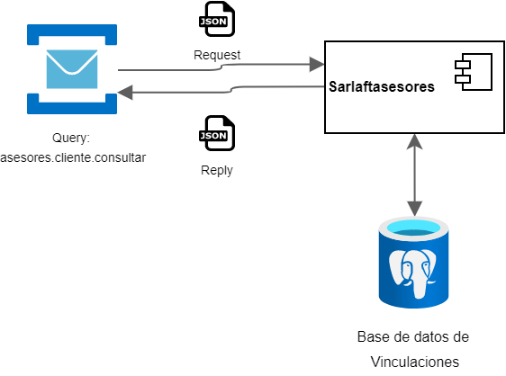

# Query Vinculaciones Cliente

> **Fuente Confluence:** [Query Vinculaciones Cliente](https://segurosti.atlassian.net/wiki/spaces/EPA/pages/2904621303/Query+Vinculaciones+Cliente)
> **Última modificación:** 2022-09-16 — Alejandra Zuleta Gonzalez (Unlicensed) · versión 3
> **Sección:** [Microservicio Asesores](./index.md)

**Objetivo**:

Obtener las vinculaciones por cliente a partir de su dni.

**Comunicación:**

**Descripción**:

El query **asesores.cliente.consultar **permite consultar los las vinculaciones de un cliente.

Con el dni del cliente en el mensaje de entrada se realiza la consulta en la base de datos de vinculaciones. A la información encontrada se le eliminan los espacios en blanco al inicio y final de cada dato.

**Nota:**

- Si la consulta es exitosa, se devuelve el campo `consultaExitosa `en true, de lo contrario se devuelve false.
- En caso de que no se encuentren vinculaciones, se devuelve vacía la lista `vinculacionesCliente`.

**Ejemplo json request:**

```json
{
  "dniCliente": "C1234567"
}
```

**Ejemplo Json reply:**

```json
{
  "consultaExitosa": true,
  "vinculacionesCliente": [
    {
      "dniCliente": "C1234567",
      "codigoAgente": "0002",
      "codigoRamo": "180"
    }
  ]
}
```

**Dependencias Ecosistema Sura:**

- Base de datos de vinculaciones: [sql-vinculaciones-dll.postgres.database.azure.com](http://sql-vinculaciones-dll.postgres.database.azure.com)
