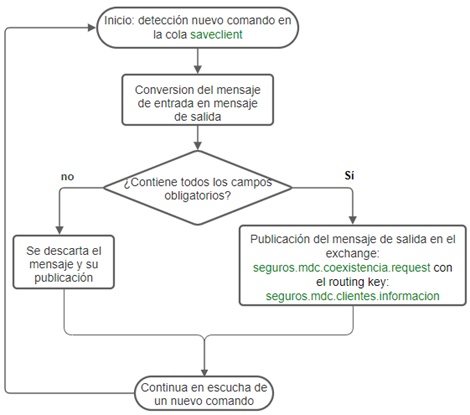

# Actualización Cliente en Modelo Sura

> **Fuente Confluence:** [Actualización Cliente en Modelo Sura](https://segurosti.atlassian.net/wiki/spaces/EPA/pages/1864597606/Actualizaci%C3%B3n+Cliente+en+Modelo+Sura)
> **Última modificación:** 2022-07-12 — Alejandra Zuleta Gonzalez (Unlicensed) · versión 7
> **Sección:** [Microservicio Azure - Actualización Cliente Sura](./index.md)

**Objetivo**:

Actualizar información del cliente en el modelo de clientes de Sura

**Comunicación:**
.png>)
**Diagrama de flujo de la funcionalidad**:

**Descripción**:

La Azure Function se ejecuta con un evento disparador de tipo timer, que permite escuchar las peticiones encoladas en la cola saveclient con el evento de nombre **Clients.client.update**, cada minuto.

Se convierten los campos, siguiendo el manual del modelo de clientes y se verifica si el mensaje de salida generado contiene los campos obligatorios siguiendo las reglas de negocio.

Si se cumplen todas las validaciones de los campos obligatorios, se publica el mensaje de salida usando la conexión a rabbitMq configurada en el application.yaml.

**Mensaje de entrada:**

{

"name": "Clients.client.update",

"commandId": "ce2cf212-cae4-46f9-a425-ef418a7966b9",

"data": {

"auditoria": {

"codigoAplicacion": "23",

"dniSolicitante": "123456789"

},

"cliente": {

"tipoPersona": "J",

"infoContacto": {

"correo": "[mail_1@mail.com.co](mailto:mail_1@mail.com.co)",

"celular": "3102345670"

},

"razonSocial": "empresa",

"documento": {

"tipo": "C",

"numero": "1049676100",

"digito": "1",

"fechaExpedicion": "2007-05-27"

},

"persona": {

"primerNombre": "Nestor",

"segundoNombre": "Fernando",

"primerApellido": "Arevalo",

"segundoApellido": "Espitia",

"pais": "01"

},

"infoFinanciera": {

"ingresos": 1,

"gastos": 1,

"activos": 1,

"pasivos": 1,

"actividadEconomica": "1",

"codigoOcupacion": "1"

},

"asociaciones": [

{

"tipoPersona": "N",

"tipoAsociacion": "AGENTE_LEGAL",

"infoContacto": {

"correo": "[mail_1@mail.com.co](mailto:mail_1@mail.com.co)",

"celular": "3102345670"

},

"razonSocial": null,

"documento": {

"tipo": "C",

"numero": "1049676100",

"digito": "1",

"fechaExpedicion": "2007-05-27"

},

"persona": {

"primerNombre": "Nestor",

"segundoNombre": "Fernando",

"primerApellido": "Arevalo",

"segundoApellido": "Espitia",

"pais": "01"

},

"direcciones": [

{

"tipo": "RS",

"pais": "01",

"departamento": "01",

"ciudad": "01",

"descripcionDireccion": "Cra 55 # 12 - 123"

}

]

}

],

"direcciones": [

{

"tipo": "RS",

"pais": "01",

"departamento": "01",

"ciudad": "01",

"descripcionDireccion": "Cra 55 # 12 - 123"

}

]

}

}

}

**Mensaje de salida:**

{

"dni_cliente": "C1049676100",

"datos_basicos": {

"primer_nombre_razon_social": "empresa",

"tipo_documento": "C",

"numero_identificacion": "C",

"digito_verificacion": "1",

"fecha_expedicion_documento": "2007/05/27",

"tipo_persona": "J"

},

"datos_ubicacion": [

{

"tipo_direccion": "RS",

"direccion": "Cra 55 # 12 - 123",

"direccion_estandarizada": "Cra 55 # 12 - 123",

"ciudad": "01",

"correo_electronico": "[mail_1@mail.com.co](mailto:mail_1@mail.com.co)",

"celular": "3102345670",

"correspondencia_fisica": "N",

"correspondencia_email": "N"

}

],

"datos_demograficos": {

"cargo_ocupacion_oficio": "1"

},

"datos_mercadeo": {

"codigo_actividad_economica": "1"

},

"contactos_empresa": [

{

"dni_contacto": "C1049676100",

"primer_nombre_contacto": "Nestor",

"segundo_nombre_contacto": "Fernando",

"primer_apellido_contacto": "Arevalo",

"segundo_apellido_contacto": "Espitia",

"codigo_referencia": "RL",

"celular": "3102345670",

"correo_electronico": "[mail_1@mail.com.co](mailto:mail_1@mail.com.co)"

}

],

"auditoria": {

"codigo_aplicacion": "23",

"dni_actualizacion": "123456789"

}

}

**Mapeo entre datos:**

** **

| **Mensaje salida** | **Mensaje entrada** | **Regla** |
| --- | --- | --- |
| dni_cliente | data/cliente/documento | Concatenación entre tipo y número de documento que vienen en el campo data/cliente/documento. |
| datos_basicos | primer_nombre_razon_social | data/cliente/persona/primerNombredata/cliente/razonSocial | Si la entrada data/cliente/tipoPersona es “N”, entonces corresponde al campo data/cliente/persona/primerNombre.Si la entrada data/cliente/tipoPersona es “J” entonces corresponde al campo data/cliente/razonSocial. |
| segundo_nombre | data/cliente/persona/segundoNombre | Asignado si la entrada data/cliente/tipoPersona es “N |
| primer_apellido | data/cliente/persona/primerApellido | Asignado si la entrada data/cliente/tipoPersona es “N” |
| segundo_apellido | data/cliente/persona/segundoApellido | Asignado si la entrada data/cliente/tipoPersona es “N” |
| tipo_documento | data/cliente/documento/tipo | |
| numero_identificacion | data/cliente/documento/numero | |
| digito_verificacion | data/cliente/documento/digito | |
| fecha_expedicion_documento | data/cliente/documento/fechaExpedicion | Recibe fechas formato tipo yyyy-mm-dd y se convierte al formato de salida yyyy/mm/dd |
| tipo_persona | data/cliente/tipoPersona | |
| datos_ubicacion | | data/cliente/direcciones | |
| tipo_direccion | .../tipo | |
| direccion | .../descripcionDireccion | |
| direccion_estandarizada | .../descripcionDireccion | |
| ciudad | .../ciudad | |
| correo_electronico | data/cliente/InfoContacto/correo | |
| celular | data/cliente/InfoContacto/celular | |
| correspondencia_fisica | | Siempre se asigna “N” |
| correspondencia_email | | Siempre se asigna “N” |
| datos_demograficos | cargo_ocupacion_oficio | data/cliente/InfoFinanciera/codigoOcupacion | |
| datos_mercadeo | codigo_actividad_economica | data/cliente/InfoFinanciera/actividadEconomica | |
| contactos_empresa | | data/cliente/asociaciones | |
| dni_contacto | .../documento/numero.../documento/tipo | Concatenación entre el tipo y el número de documento. |
| primer_nombre_contacto | .../persona/primerNombre | |
| segundo_nombre_contacto | .../persona/segundoNombre | |
| primer_apellido_contacto | .../persona/primerApellido | |
| segundo_apellido_contacto | .../persona/segundoApellido | |
| codigo_referencia | .../tipoAsociacion | Si el campo tipo asociacion de entrada es "AGENTE_LEGAL"se asigna “RL”.Si el campo de entrada es "ACCIONISTA"se asigna “CO”. |
| celular | .../infoContacto/celular | |
| correo_electronico | .../infoContacto/correo | |
| direccion | .../descripcionDireccion | Se asigna el campo descripcionDireccion de la primera dirección en la lista de direcciones de la asociación. |
| municipio | .../ciudad | Se asigna el campo ciudad de la primera dirección en la lista de direcciones de la asociación. |
| auditoria | codigo_aplicacion | data/auditoria/codigoAplicacion | |
| dni_actualizacion | data/auditoria/dniSolicitante | |

**Dependencias Ecosistema Sura:**

Mensaje Destino en RabbitMQSura:

**Usuario de Conexión: seguros.sarlaftmcmi.usr**

**URL RabbitMQ DLLO: **[msgdllo.suramericana.com.co](http://msgdllo.suramericana.com.co:15672/)

**URL RabbitMQ LABO: **[msglab.suramericana.com.co](http://msglab.suramericana.com.co:15672/)

**Exchange RabbitMQ: seguros.mdc.coexistencia.request**
