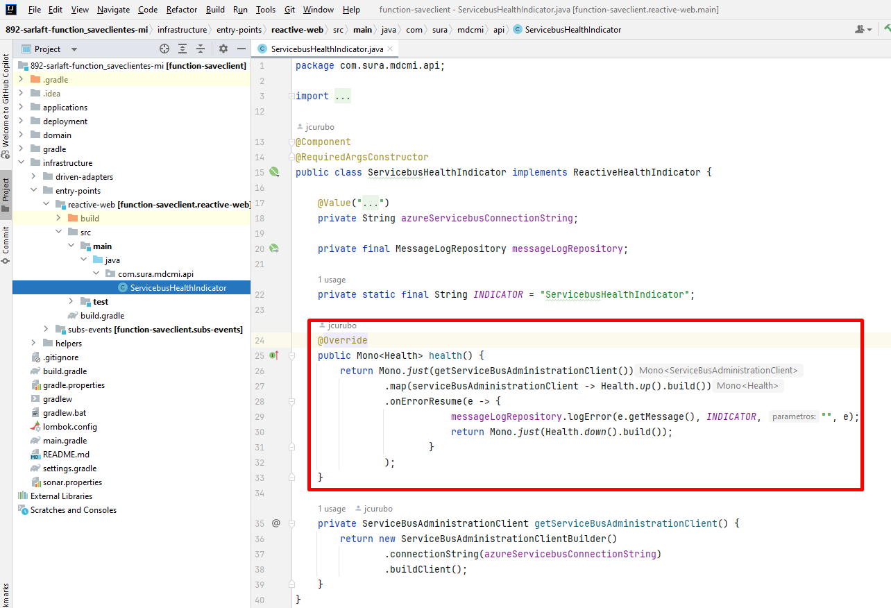
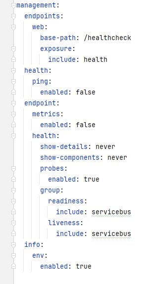
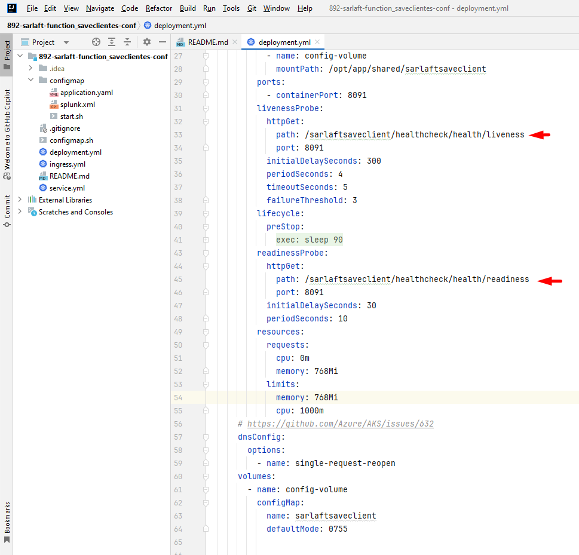

# Configuración HealtchCheck con librería actuator - sarlaftsaveclient

> **Fuente Confluence:** [Configuración HealtchCheck con librería actuator - sarlaftsaveclient](https://segurosti.atlassian.net/wiki/spaces/EPA/pages/3532685424/Configuraci%C3%B3n+HealtchCheck+con+librer%C3%ADa+actuator+-+sarlaftsaveclient)
> **Última modificación:** 2024-02-08 — Julián Andrés Curubo García · versión 1
> **Sección:** [Microservicio Azure - Actualización Cliente Sura](./index.md)

Este nuevo servicio web de healthCheck permite evaluar las conexiones principales del microservicio de tal forma que cuando desde el aks en azure, se haga el ping para evaluar la salud del microservicio se evalué de igual forma la conexión al service bus de azure.

Con la librería de spring actuator `spring-boot-starter-actuator` se logra este objetivo, se incluye la librería en el build.gradle

La validación con el sevice bus se utiliza una clase personalizada `ServicebusHealthIndicator` en la cual se usa la dependencia `'com.azure:azure-messaging-servicebus:7.14.7'`

Se realiza la siguiente configuración en el **application.yaml**

Se realiza la siguiente configuración en el archivo **deployment.yml** en el proyecto de configuración para cada ambiente.

