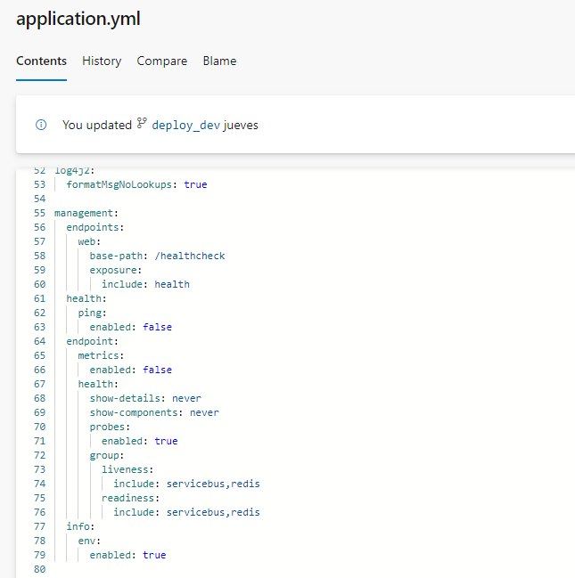
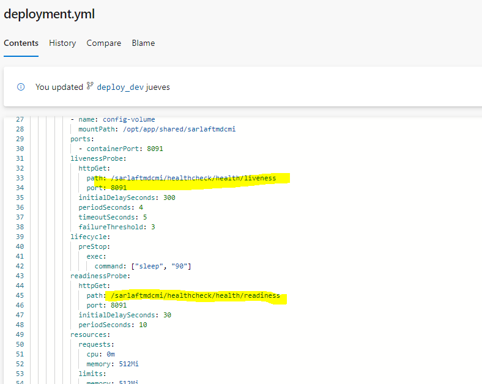

# Configuración HealtchCheck con librería actuator - mdcmi

> **Fuente Confluence:** [Configuración HealtchCheck con librería actuator - mdcmi](https://segurosti.atlassian.net/wiki/spaces/EPA/pages/3617161250/Configuraci%C3%B3n+HealtchCheck+con+librer%C3%ADa+actuator+-+mdcmi)
> **Última modificación:** 2024-04-04 — Diana Muñoz · versión 2
> **Sección:** [Microservicio Azure - Clientes](./index.md)

Este nuevo servicio web de healthCheck permite evaluar las conexiones principales del microservicio de tal forma que cuando desde el aks en azure, se haga el ping para evaluar la salud del microservicio se evalué de igual forma las conexiones a redis y conexión al service bus de azure.

Con la librería de spring actuator `spring-boot-starter-actuator` se logra este objetivo, se incluye la librería en el main.gradle

La validación con la cache Azure Redis se hace automáticamente con el indicador por defecto RedisHealthIndicator que trae la librería spring actuator.

La validación con el service bus se utiliza una clase personalizada `ServicebusHealthIndicator`.

Se realiza la siguiente configuración en el **application.properties**

Se realiza la siguiente configuración en el archivo deployment.yml en el proyecto de configuración para cada ambiente.

