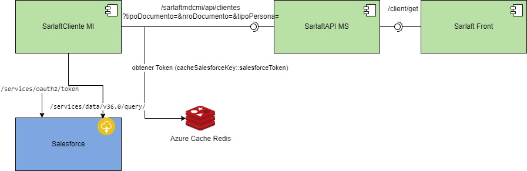

# Integración consulta cliente en salesforce

> **Fuente Confluence:** [Integración consulta cliente en salesforce](https://segurosti.atlassian.net/wiki/spaces/EPA/pages/2771812833/Integraci%C3%B3n+consulta+cliente+en+salesforce)
> **Última modificación:** 2024-01-25 — Diana Muñoz · versión 2
> **Sección:** [Microservicio Azure - Clientes](./index.md)

**Objetivo:** conocer la información de un cliente en el aplicativo de salesforce de sura

La descripción de los servicios web en el aplicativo de sarlaft se encuentran en:

[Servicio Web - Sarlaftmdcmi](./ServicioWebSarlaftmdcmi.md)

[Servicio Consulta de Clientes](https://segurosti.atlassian.net/wiki/spaces/EPA/pages?title=Servicio%20Consulta%20de%20Clientes)
