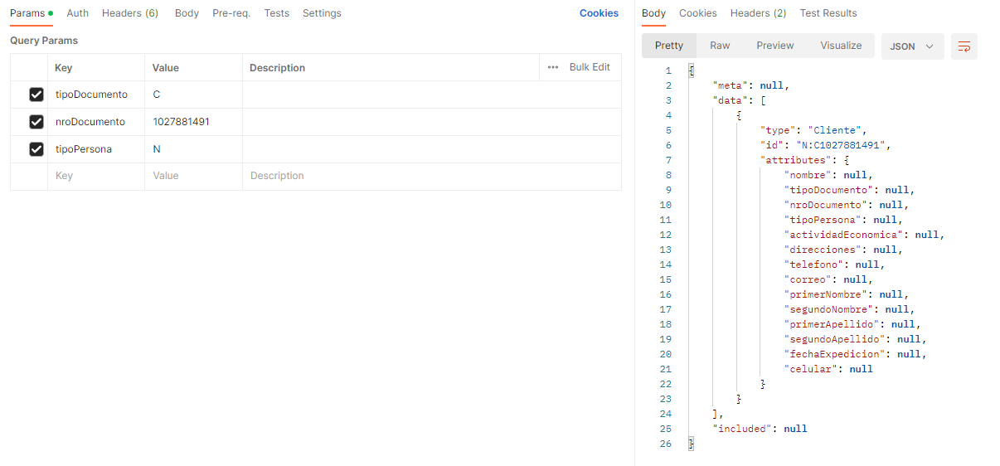
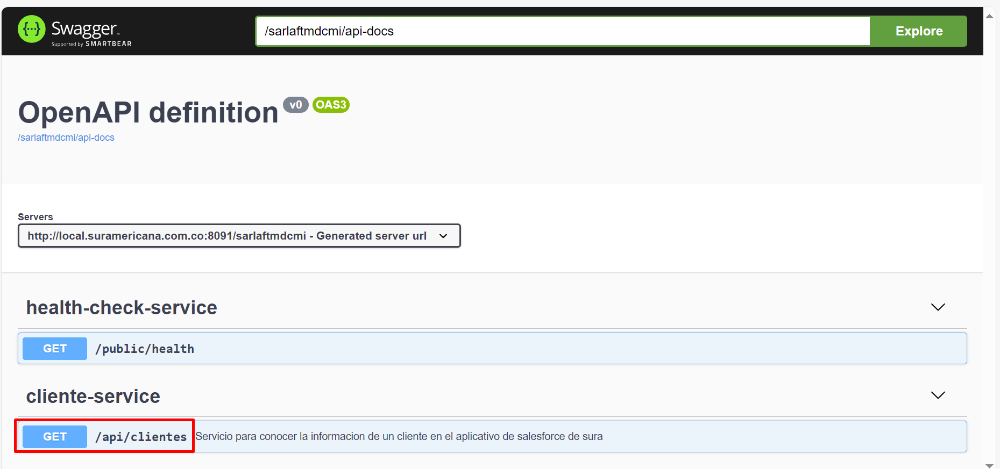

# Servicio Web - Sarlaftmdcmi

> **Fuente Confluence:** [Servicio Web - Sarlaftmdcmi](https://segurosti.atlassian.net/wiki/spaces/EPA/pages/3386638371/Servicio+Web+-+Sarlaftmdcmi)
> **Última modificación:** 2023-10-27 — Julián Andrés Curubo García · versión 12
> **Sección:** [Microservicio Azure - Clientes](./index.md)

- **Objetivo: **Permite conocer la información de un cliente en el aplicativo de salesforce de sura. Este servicio se expone en reemplazo de la comunicación request reply que se tenia por medio del service bus, donde se integran las funcionalidades del query “`Clients.client.findById`".
- **Endpoint:** /sarlaftmdcmi/api/clientes
- **Perfil de Seus4: **NO aplica. Este servicio se expone interno al cluster del aks, por lo tanto se convierte en una comunicación back to back.
- **Ejemplo parámetros de entrada:**
  /sarlaftmdcmi/api/clientes?tipoDocumento=C&nroDocumento=1027881491&tipoPersona=N
  
- **Ejemplo response:**
```
{
    "meta": null,
    "data": [
        {
            "type": "Cliente",
            "id": "N:C1027881491",
            "attributes": {
                "nombre": null,
                "tipoDocumento": null,
                "nroDocumento": null,
                "tipoPersona": null,
                "actividadEconomica": null,
                "direcciones": null,
                "telefono": null,
                "correo": null,
                "primerNombre": null,
                "segundoNombre": null,
                "primerApellido": null,
                "segundoApellido": null,
                "fechaExpedicion": null,
                "celular": null
            }
        }
    ],
    "included": null
}
```

- **Documentación swagger:** /sarlaftmdcmi/swagger-ui.html

