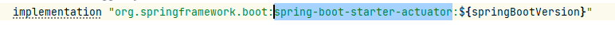
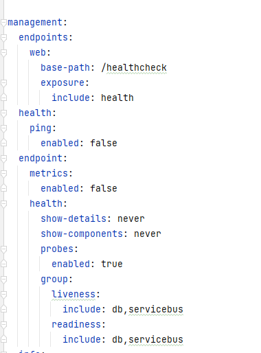
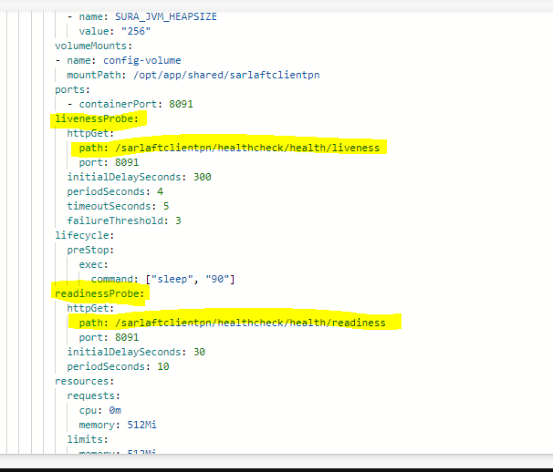

# Configuración HealtchCheck con librería actuator

> **Fuente Confluence:** [Configuración HealtchCheck con librería actuator](https://segurosti.atlassian.net/wiki/spaces/EPA/pages/3530391611/Configuraci%C3%B3n+HealtchCheck+con+librer%C3%ADa+actuator)
> **Última modificación:** 2024-02-07 — Diana Muñoz · versión 2
> **Sección:** [Microservicio Azure - Clientes PN](./index.md)

Este nuevo servicio web de healthCheck permite evaluar las conexiones principales del microservicio de tal forma que cuando desde el aks en azure, se haga el ping para evaluar la salud del microservicio se evalué de igual forma las conexiones a base de datos y conexión al service bus de azure.

Conexión a base de datos Oracle PDN (Onpremise)

Con la librería de spring actuator `spring-boot-starter-actuator` se logra este objetivo, se incluye la librería en el main.gradle

La validación con la base de datos se hace automáticamente con el indicador por defecto DataSourceHealthIndicator que trae la librería, y obtiene el datasource utilizando la información de conexión a la base de datos del archivo application.yml.

La validación con el sevice bus se utiliza una clase personalizada `ServicebusHealthIndicator`.

Se realiza la siguiente configuración en el **application.properties**

Se realiza la siguiente configuración en el archivo deployment.yml en el proyecto de configuración para cada ambiente.

