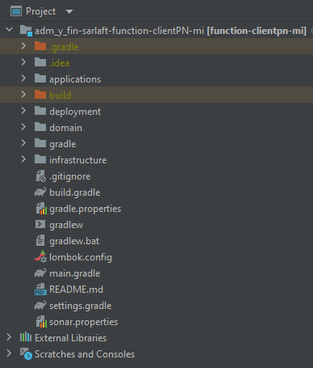
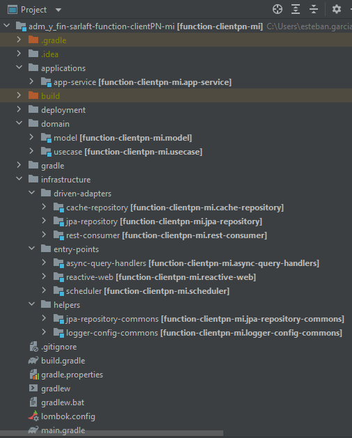

# Estructura Proyecto - Microservicio ClientesPN

> **Fuente Confluence:** [Estructura Proyecto - Microservicio ClientesPN](https://segurosti.atlassian.net/wiki/spaces/EPA/pages/2774958195/Estructura+Proyecto+-+Microservicio+ClientesPN)
> **Última modificación:** 2022-06-17 — Diana Muñoz · versión 1
> **Sección:** [Microservicio Azure - Clientes PN](./index.md)

La WebApp clientepn está construida a partir del generador de legos de Sura, se basa en arquitectura hexagonal, generando los siguientes componentes:

Figura 1. Estructura del proyecto.

El proyecto está dividido en los siguientes subproyectos (Figura 2):

Figura 2. Subproyectos.

**1.applications-app-service**: contiene configuraciones generales del aplicativo, importa los módulos de las otras capas que siguen la Clean Architecture (Dominio e Infraestructura). Es la encargada de la interacción con el framework utilizado, sus complementos y la configuración de la ejecución de la WebApp.

En el archivo de configuración application.yaml se encuentran las propiedades parametrizables para consumir el servicio rest (Consultar perfil cliente).

Adicionalmente, las configuraciones para conexión a base de datos de Sura donde se busca la homologación de los códigos de ciudad, departamento y país.

En el archivo de configuración application.properties se encuentran las propiedades parametrizables para la conexión con redis donde se cargan los códigos homologados de Sura para ciudad, departamento y país.

**2. domain**

: La capa de dominio es la capa más interna del proyecto y es la encargada de dar las directivas del proceso teniendo en cuenta la lógica de negocio:

**a. model**: representa los objetos de dominio (negocio) del aplicativo, sus características y comportamientos.

**b. use-case**: contiene los dos casos de uso desarrollados: ConsultarClientePnUseCase: Petición y respuesta del query de forma síncrona para la consulta del servicio web de perfil del cliente y la homologación de los códigos de ciudad, departamento y país hacia redis.

PostalUseCase: Consulta de postales en la base de datos de Sura para obtener los códigos de ciudad, departamento y país. Carga del listado de postales hacia redis.

Se ejecutan en la aplicación desde el proxy de la capa de infraestructura. Interactúan con los modelos para la conversión de los datos de entrada en la consulta REST, consulta y carga en redis y para la consulta de las postales en la base de datos de Sura.

**3.infrastructure**:

**a. driven-adapters-cache-repository: **adaptador que permite realizar la consulta y carga de postales usando un cliente de Redis.

**b. driven-adapters-jpa-repository: **adaptador que permite realizar la consulta de postales usando un cliente JPA.

**c. driven-adapters-rest-consumer: **adaptador que permite realizar la consulta usando un cliente RestWeb.

**d. entry-points-async-query-handlers: **módulo para recibir y dar respuesta de queries del service bus.

**e. entry-points-reactive-web: **módulo para exponer servicios web.

**f. entry-points-scheduler: **módulo para la ejecución de Jobs con Spring para consultar postales de la base de datos de sura y cargar las postales a redis.

**g. helpers-logger-config-commons: **configuración de sistema de log Splunk.

**g. helpers-logger-config-commons: **abstracción de métodos para utilizar el cliente JPA.
