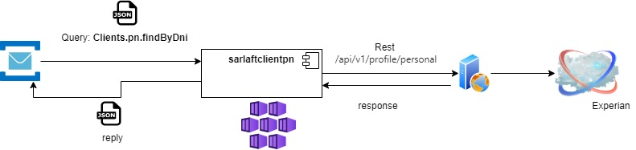

# Query Consulta Perfil Cliente

> **Fuente Confluence:** [Query Consulta Perfil Cliente](https://segurosti.atlassian.net/wiki/spaces/EPA/pages/2773549912/Query+Consulta+Perfil+Cliente)
> **Última modificación:** 2022-06-17 — Diana Muñoz · versión 1
> **Sección:** [Microservicio Azure - Clientes PN](./index.md)

**Objetivo**:

Consultar el perfil de un cliente en la base de datos de Experian

**Comunicación:**

**Descripción**:

El microservicio que escucha las peticiones encoladas en la cola del service bus con el evento de nombre **Clients.pn.findByDni**.

Con el mensaje de entrada se realiza la consulta con el cliente web, el cliente de redis y se convierten los datos al mensaje de salida correspondiente para responder al query.

**Mensaje de Entrada:**

{

"tipoDocumento":"C",

"numeroDocumento":" 888888881",

"primerApellido":"PRUEBAS"

}

**Mensaje de Salida:**

{

"nombre": " PRUEBAS PEREZ JUAN",

"tipoDocumento": "C",

"numeroDocumento": " 888888881",

"tipoPersona": "N",

"actividadEconomica": null,

"direcciones": [

{

"dsDireccion": "DG 88 8 8 BELEN 888",

"tipoDireccion": "RS",

"ciudad": "4292",

"departamento": "05",

"pais": "57"

}

],

"telefono": null,

"correo": "",

"representanteLegal": null,

"valorAsegurado": null,

"sector": null,

"primerNombre": "JUAN",

"segundoNombre": "",

"primerApellido": "PRUEBAS",

"segundoApellido": "PEREZ",

"fechaExpedicion": " 1988-10-05T00:00:00.000+00:00",

"celular": "",

"ingresos": "",

"egresos": "81000.0",

"nacionalidad": ""

}

**Mapeo de los campos de respuesta con los del mensaje de salida:**

| direcciones.ciudad | El servicio web devuelve un código con el cual se consulta a redis el código homologado en Sura para la ciudad. |
| --- | --- |
| direcciones.departamento | El servicio web devuelve un código con el cual se consulta a redis el código homologado en Sura para el departamento. |
| direcciones.pais | El servicio web devuelve un código con el cual se consulta a redis el código homologado en Sura para el país. |

Los demás campos se envían tal cual los devuelve el servicio web consultado.

** **

**Dependencias Ecosistema Sura:**

**DLLO:**

URL DLLO: [https://sarlaftapi.dllosura.com/api/v1/profile/personal](https://sarlaftapi.dllosura.com/api/v1/profile/personal)

BD PDN consulta en tabla postal

**LABO:**

URL LABO [https://sarlaftapi.labsura.com/api/v1/profile/personal](https://sarlaftapi.labsura.com/api/v1/profile/personal)

BD PDN consulta en tabla postal
