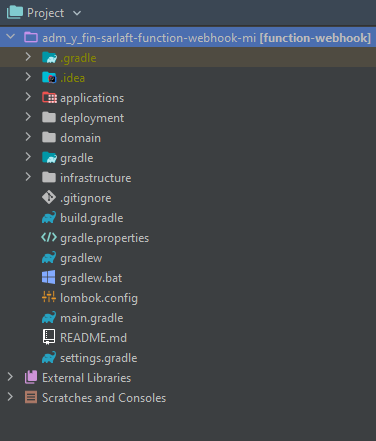
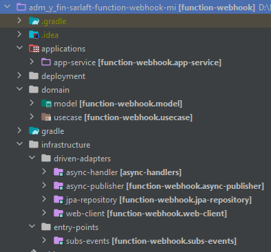

# Estructura Proyecto - MicroServicio Webhook

> **Fuente Confluence:** [Estructura Proyecto - MicroServicio Webhook](https://segurosti.atlassian.net/wiki/spaces/EPA/pages/2183528474/Estructura+Proyecto++-+MicroServicio+Webhook)
> **Última modificación:** 2022-06-08 — juan camilo muñoz burgos (Unlicensed) · versión 3
> **Sección:** [MicroServicio Azure - Webhook](./index.md)

El MicroServicio Notificacion Webhook está construida a partir del generador de legos de Sura, se basa en arquitectura hexagonal, generando los siguientes componentes:

Figura 1. Estructura del proyecto.

El proyecto está dividido en los siguientes subproyectos (Figura 2):

Figura 2. Subproyectos.

1. **applications-app-service**: contiene configuraciones generales del aplicativo, importa los módulos de las otras capas que siguen la Clean Architecture (Dominio e Infraestructura). Es la encargada de la interacción con el framework utilizado, sus complementos y la configuración de la ejecución del Azure MicroServicio.

En el archivo de configuración application.yaml se encuentran las propiedades parametrizables para la suscripción y escucha del comando de entrada (rabbitmq) y el nombre del comando escuchado. Además, se tiene la configuración para la publicación del mensaje de salida en el RabbitMqSura (host, username, password, port, virtualhost, exchange, routingkey) y la configuración con la base de datos postgres de Sarlaft.

**2. domain**: La capa de dominio es la capa más interna del proyecto y es la encargada de dar las directivas del proceso teniendo en cuenta la lógica de negocio:

1. **model**: representa los objetos de dominio (negocio) del aplicativo, sus características y comportamientos.
2. **use-case**: contiene el único caso de uso (actividad) que se ejecuta en la aplicación desde el proxy de la capa de infraestructura. Interactúa con los modelos para la validación de los campos obligatorios en el mensaje de salida.

**3. infrastructure**:

1. **driven-adapters-async-handler:**adaptador que permite la subscripción y escucha del query de entrada.
2. **driven-adapters-async-publisher: **Adaptador que permite la escritura simple en las colas de Sura
3. **driven-adapters-jpa-repository: **Adaptador que permite la conexión y consumo de base de datos postgres y caché en Azure Redis
4. **driver-adapters-web-client: **adaptador que permite el consumo de servicios REST.
5. **entry-points-subs-events: **paquete donde se configura el azure MicroServicio y el timmer que la dispara.
