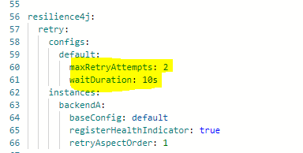

# Reintentos en entrega de mensaje webhook

> **Fuente Confluence:** [Reintentos en entrega de mensaje webhook](https://segurosti.atlassian.net/wiki/spaces/EPA/pages/3564339217/Reintentos+en+entrega+de+mensaje+webhook)
> **Última modificación:** 2024-02-22 — Diana Muñoz · versión 1
> **Sección:** [MicroServicio Azure - Webhook](./index.md)

El microservicio de webbhook toma la configuración del destino del mensaje de webhook de la tabla tsaf_consumidor, en esta configuración existen dos tipos de comunicaciones

***QUEUE***: para publicar el mensaje en el exchange de sarlaft en Rabbitmq y redirigirse a la cola de respuesta configurada para la aplicación cliente.

El numero de reintentos para publicar el mensaje en Rabbitmq es de 2 veces y se configura a través de la propiedad `resilience4j`.`retry`.`configs`.`default`.`maxRetryAttempts`.

***REST: ***para entregar el mensaje consumiendo un servicios web rest.

Para entregar el mensaje a través del servicio web no se tienen configurado reintentos dado que la experiencia que hemos tenido en producción, indica que con estos reintentos podemos estar afectando la disponibilidad de los servicios web de los aplicativos externos.
