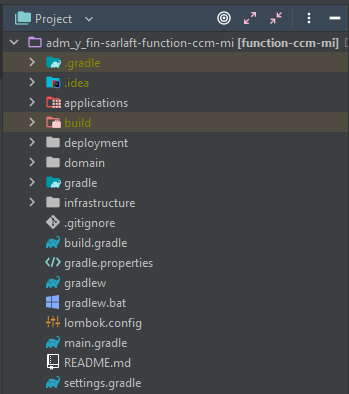
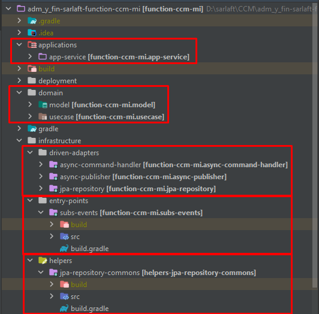

# Estructura Proyecto - Microservicio CCM

> **Fuente Confluence:** [Estructura Proyecto - Microservicio CCM](https://segurosti.atlassian.net/wiki/spaces/EPA/pages/2346123323/Estructura+Proyecto+-+Microservicio+CCM)
> **Última modificación:** 2022-07-12 — Alejandra Zuleta Gonzalez (Unlicensed) · versión 4
> **Sección:** [Microservicio - CCM](./index.md)

El microservicio sarlaftccm está construido a partir del generador de legos de Sura, se basa en

arquitectura hexagonal, generando los siguientes componentes:

El proyecto está dividido en los siguientes subproyectos (Figura 2):

1. **applications-app-service: **contiene configuraciones generales del aplicativo, importa los módulos de las otras capas que siguen la Clean Architecture (Dominio e Infraestructura). Es la encargada de la interacción con el framework utilizado, sus complementos y la configuración de la ejecución de la Azure Function.

En el archivo de configuración application.yaml se encuentran las propiedades parametrizables para la suscripción y escucha del comando de entrada (rabbitmq) y el nombre del comando escuchado. Además, se tiene la configuración para la publicación del mensaje de salida en el RabbitMqCCM (host, username, password, port, virtualhost, exchange, routingkey).

**2. domain**: La capa de dominio es la capa más interna del proyecto y es la encargada de dar las directivas del proceso teniendo en cuenta la lógica de negocio:

**a. model**: representa los objetos de dominio (negocio) del aplicativo, sus características y comportamientos.

**b. use-case**: contiene los casos de uso (actividades) que se ejecutan en la aplicación desde el proxy de la capa de infraestructura. Interactúa con los modelos para la validación de los campos obligatorios en el mensaje de salida.

**3. infrastructure**:

**a. driven-adapters-async-publisher: **adaptador que permite la publicación de mensajes en el RabbitMqCCM usando RabbitTemplate.

**b. driven-adapters-async-command-handler: **adaptador que permite la subscripción y escucha del comando de entrada.

**c. jpa-repository: **adaptador que permite consultar la información necesaria para enviar a CCM en la base de datos, de sarlaftapi

**d. entry-points-subs-events: **receptor donde se configura la cola de Rabbit escuchada que dispara la Azure Function.
