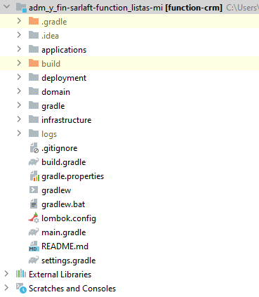
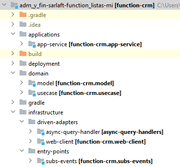

# Estructura Proyecto - Microservicio Catalogos

> **Fuente Confluence:** [Estructura Proyecto - Microservicio Catalogos](https://segurosti.atlassian.net/wiki/spaces/EPA/pages/2072477918/Estructura+Proyecto+-+Microservicio+Catalogos)
> **Última modificación:** 2022-06-08 — Diana Muñoz · versión 3
> **Sección:** [Microservicio - Catálogos](./index.md)

El microservicio está construido a partir del generador de legos de Sura, se basa en arquitectura hexagonal, generando los siguientes componentes:

Figura 1. Estructura del proyecto.

El proyecto está dividido en los siguientes subproyectos (Figura 2):

Figura 2. Subproyectos.

1. **applications-app-service**: contiene configuraciones generales del aplicativo, importa los módulos de las otras capas que siguen la Clean Architecture (Dominio e Infraestructura). Es la encargada de la interacción con el framework utilizado y sus complementos.

En el archivo de configuración application.yaml se encuentran las propiedades parametrizables para la respuesta de la petición en el RabbitMq (host, username, password) y los parámetros para consumir el servicio soap (uri, actionCallBack).

**2. domain**: La capa de dominio es la capa más interna del proyecto y es la encargada de dar las directivas del proceso teniendo en cuenta la lógica de negocio:

**a.model**: representa los objetos de dominio (negocio) del aplicativo, sus características y comportamientos.

**b. use-case**: contiene el único caso de uso (actividad) que se ejecuta en la aplicación desde el proxy de la capa de infraestructura. Interactúa con los modelos para la conversión de los datos de entrada en el query de la consulta soap.

**3. infrastructure**:

**a. driven-adapters-async-event-bus: **adaptador que permite la comunicación y dar respuesta al query por medio de RabbitMq.

**b. driven-adapters-web-client:**

**c. entry-points-subs-events: **receptor donde se configura el timer que dispara la Azure [Function.](http://Function.NO) NO es utilizado
