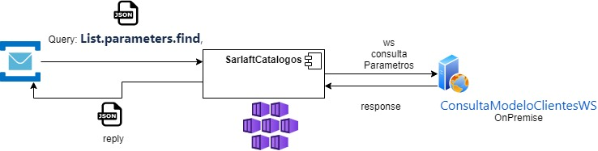

# Query Catalogos

> **Fuente Confluence:** [Query Catalogos](https://segurosti.atlassian.net/wiki/spaces/EPA/pages/2075131937/Query+Catalogos)
> **Última modificación:** 2022-06-15 — Diana Muñoz · versión 6
> **Sección:** [Microservicio - Catálogos](./index.md)

**Objetivo**:

Obtener los valores de los catálogos solicitados por medio de un mensaje.

**Comunicación:**

**Descripción**:

El query **List.parameters.find** permite consultar los catalogos solicitados en el servicio web de ConsultaModeloClientesWS de forma sincrona.

Con el mensaje de entrada se realiza la consulta con el cliente soap y se convierten los datos al mensaje de salida correspondiente para responder al query dejado en RabbitMq.

**Json request:**

{

"codigoCatalogo": "TIPOSDOCUMENTOS1_2",

"pais": "57",

"departamento": "",

"tipoPersona": "J",

"codigo": "",

"descripcion": ""

}

**Json reply:**

{

"parametros": [

{

"codigo": "F",

"descripcion": "ID. FISCAL PARA EXTRANJEROS"

},

{

"codigo": "A",

"descripcion": "NIT"

},

{

"codigo": "J",

"descripcion": "P. JURIDICA SIN IDENTIFICACION"

}

]

}

**Mapeo entre datos:**

Mapeo del mensaje de entrada del mensaje con el mensaje del request del ws soap

| codigoCatalogo | tipo |
| --- | --- |
| país | pais |
| departamento | departamento |
| tipoPersona | tipoPersona |
| codigo | codigo |
| descripcion | descripcion |

**Filtros de los parámetros de salida:**

- Cuando el campo codigoCatalogo en el mensaje de entrada corresponde a "TIPOSDOCUMENTOS1_2", entonces se filtran los parámetros obtenidos, devolviendo solo aquellos que tienen codigos en la siguiente lista:

| **Código** | **Descripción** |
| --- | --- |
| E | CED.EXTRANJERIA |
| C | CEDULA |
| D | DIPLOMATICO |
| X | DOC.IDENT. DE EXTRANJEROS |
| N | NUIP |
| P | PASAPORTE |
| TP | PASAPORTE ONU |
| T | TARJ.IDENTIDAD |
| F | IDENT. FISCAL PARA EXT. |
| A | NIT |
| J | P. JURIDICA SIN IDENTIFICACION |

- Cuando el campo codigoCatalogo en el mensaje de entrada corresponde a "ACTIVIDADESECO" se retornan solo las actividades de ciuu4, es decir aquellas cuyo código empieza con N.

**Dependencias Ecosistema Sura:**

Url DLLO: [http://segdllo02.suranet.com/ServiciosWebSic/services/ConsultaModeloClientesWS?wsdl](http://segdllo02.suranet.com/ServiciosWebSic/services/ConsultaModeloClientesWS?wsdl)

Url LABO: [https://siclab.suranet.com/ServiciosWebSic/services/ConsultaModeloClientesWS?wsdl](https://siclab.suranet.com/ServiciosWebSic/services/ConsultaModeloClientesWS?wsdl)
