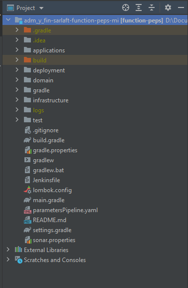
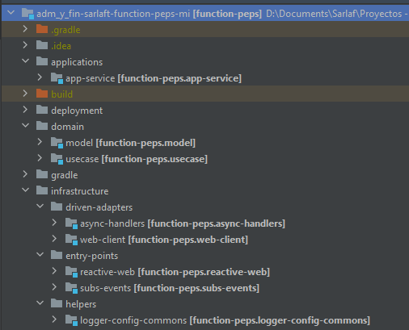

# Estructura Proyecto - Microservicio PEPS

> **Fuente Confluence:** [Estructura Proyecto - Microservicio PEPS](https://segurosti.atlassian.net/wiki/spaces/EPA/pages/1860862179/Estructura+Proyecto+-+Microservicio+PEPS)
> **Última modificación:** 2022-07-12 — Alejandra Zuleta Gonzalez (Unlicensed) · versión 7
> **Sección:** [Microservicio - Clientes PEP](./index.md)

El microservicio de integracion peps está construido a partir del generador de legos de Sura, se basa en

arquitectura hexagonal, generando los siguientes componentes:

Figura 1. Estructura del proyecto.

El proyecto está dividido en los siguientes subproyectos (Figura 2):

Figura 2. Subproyectos.

**1.applications-app-service**: contiene configuraciones generales del aplicativo, importa los módulos de las otras capas que siguen la Clean Architecture (Dominio e Infraestructura). Es la encargada de la interacción con el framework utilizado, sus complementos y la configuración de la ejecución de la Azure Function.

En el archivo de configuración application.yaml se encuentran las propiedades parametrizables para la publicación del comando de respuesta en el RabbitMq (host, username, password), los nombres del evento que escucha para responder el query (Consulta cliente peps), el nombre de la aplicación objetivo a la cual le envía el comando de respuesta (envío de notificación) y los parámetros para consumir el servicio rest (Consulta y marcación de cliente peps).

Adicionalmente, las configuraciones para escuchar la cola en el RabbitMQ Sura se encuentran en los archivos host.json y local.settings.json (Origen de la notificación peps).

**2. domain**: La capa de dominio es la capa más interna del proyecto y es la encargada de dar las directivas del proceso teniendo en cuenta la lógica de negocio:

**a. model**: representa los objetos de dominio (negocio) del aplicativo, sus características y comportamientos.

**b. use-case**: contiene los tres casos de uso desarrollados: petición y respuesta del query en el primer caso, en el segundo en el cual transporta/comunica la notificación y el tercer caso de uso que marca un cliente como peps. Se ejecutan en la aplicación desde el proxy de la capa de infraestructura. Interactúan con los modelos para la conversión de los datos de entrada en el query de la consulta REST y para la emisión de los comandos de salida.

**3.infrastructure**:

**a. driven-adapters-async-handlers: **adaptadores que permiten la comunicación por medio de RabbitMq, en el caso del AsyncMessageConfig para dar respuesta al query y escuchar el comando para marcar cliente peps y AsyncCommandConfig para la emisión del comando de salida con la notificación recibida y con el comando de salida de la marcación de cliente peps.

**b. driven-adapters-web-client: **adaptador que permite realizar la consulta usando un cliente RestWeb.

**c. entry-points-reactive-web: **módulo para servicios web.

**d. entry-points-subs-events: **receptor donde se configura el listener de la cola en RabbitMq.

**e. helpers-logger-config-commons: **configuración de sistema de log Splunk.
