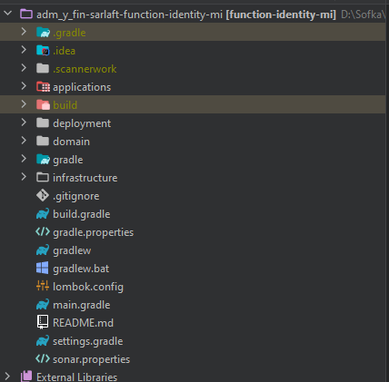
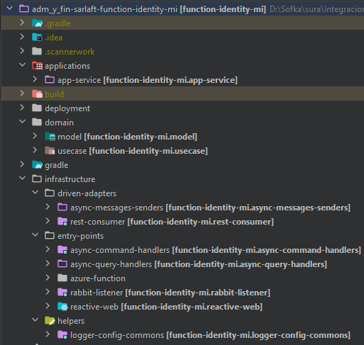

# Estructura Proyecto - Microservicio Identity

> **Fuente Confluence:** [Estructura Proyecto - Microservicio Identity](https://segurosti.atlassian.net/wiki/spaces/EPA/pages/2786329750/Estructura+Proyecto+-+Microservicio+Identity)
> **Última modificación:** 2022-06-29 — Alejandra Zuleta Gonzalez (Unlicensed) · versión 1
> **Sección:** [Microservicio - Identity](./index.md)

El microservicio está construido a partir del generador de legos de Sura, se basa en arquitectura hexagonal, generando los siguientes componentes:

Figura 1. Estructura del proyecto.

El proyecto está dividido en los siguientes subproyectos (Figura 2):

Figura 2. Subproyectos.

1. **applications-app-service**: contiene configuraciones generales del aplicativo, importa los módulos de las otras capas que siguen la Clean Architecture (Dominio e Infraestructura). Es la encargada de la interacción con el framework utilizado y sus complementos.

En el archivo de configuración application.yaml se encuentran las propiedades parametrizables para el consumo de mensajería através de Azure Service Bus.

**2. domain**: La capa de dominio es la capa más interna del proyecto y es la encargada de dar las directivas del proceso teniendo en cuenta la lógica de negocio:

**a.model**: representa los objetos de dominio (negocio) del aplicativo, sus características y comportamientos.

**b. use-case**: contiene los casos de uso de validación de identidad y registraduría que se ejecutan en la aplicación desde el proxy de la capa de infraestructura.

**3. infrastructure**:

**a. driven-adapters-async-message-senders: **adaptador que permite la comunicación y dar respuesta por medio de comandos y el servicio de mensajería service bus.

**b. driven-adapters-rest-consumer: **adaptador que permite consumir el servicio rest para hacer las validaciones.

**c. entry-points-async.command-handlers: **receptor para recibir los comandos en la aplicación.

**d. entry-points-async.command-handlers: **receptor para recibir los queries en la aplicación.

**e. entry-point-reactive-web:** receptor web con el servicio rest health.
