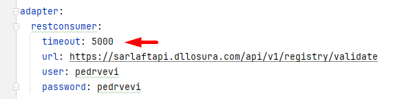
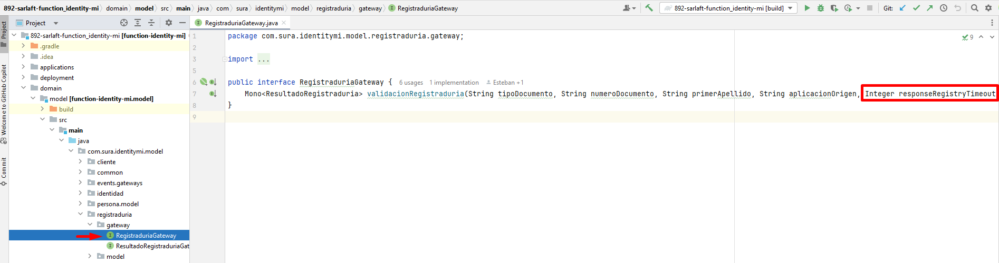

# Parametrización para tiempo de timeout consumo registraduria - identity

> **Fuente Confluence:** [Parametrización para tiempo de timeout consumo registraduria - identity](https://segurosti.atlassian.net/wiki/spaces/EPA/pages/3767599241/Parametrizaci%C3%B3n+para+tiempo+de+timeout+consumo+registraduria+-+identity)
> **Última modificación:** 2024-06-07 — Julián Andrés Curubo García · versión 8
> **Sección:** [Microservicio - Identity](./index.md)

Se parametriza el tiempo para el timeout de la respuesta de ws de registraduría.

En el proyecto 892-sarlaft-function_identity-conf → application.yaml por medio de la propiedad timeout se parametriza el tiempo en milisegundos que se considere se deba esperar la respuesta del ws de la regitraduría antes de manejarse como un error por timeout:

Este nuevo parámetro se envía a la firma **validacionRegistraduria** de la interfaz **RegistraduriaGateway:**

