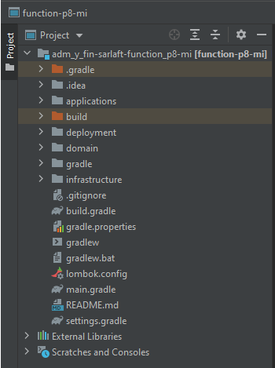
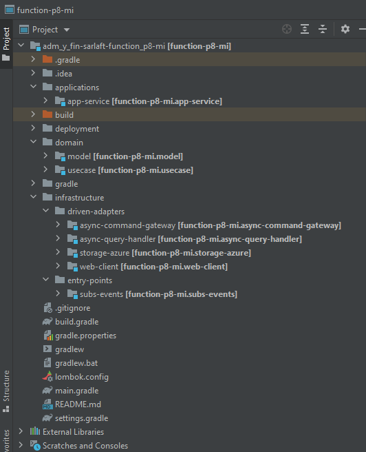

# Estructura del proyecto - Microservicio P8

> **Fuente Confluence:** [Estructura del proyecto - Microservicio P8](https://segurosti.atlassian.net/wiki/spaces/EPA/pages/2144764130/Estructura+del+proyecto+-+Microservicio+P8)
> **Última modificación:** 2022-07-12 — Alejandra Zuleta Gonzalez (Unlicensed) · versión 2
> **Sección:** [Microservicio - P8](./index.md)

El microservicio p8 está construida a partir del generador de legos de Sura, se basa en arquitectura hexagonal, generando los siguientes componentes (Figura 1):

El proyecto está dividido en los siguientes subproyectos (Figura 2):

1. **applications-app-service**: contiene configuraciones generales del aplicativo, importa los módulos de las otras capas que siguen la Clean Architecture (Dominio e Infraestructura). Es la encargada de la interacción con el framework utilizado, sus complementos y la configuración de la ejecución de la Azure Function.
   En el archivo de configuración application.yaml se encuentran las propiedades parametrizables para la respuesta de la petición en el RabbitMq (host, username, password) y los parámetros para consumir el servicio de carga de archivos a FileNet P8 y AzureStorage.
2. **domain**: La capa de dominio es la capa más interna del proyecto y es la encargada de dar las directivas del proceso teniendo en cuenta la lógica de negocio:
   **a**. **model**: representa los objetos de dominio (negocio) del aplicativo, sus características y comportamientos.**b**. **use-case**: contiene el único caso de uso (actividad) que se ejecuta en la aplicación desde el proxy de la capa de infraestructura. Interactúa con los modelos para la conversión de los datos de entrada para la carga de archivos a FileNet P8 y encargado de notificar el resultado de la carga a RabbitMq.
3. **infrastructure**:
   **a.** **async-command-gateway: **adaptador que permite poner la respuesta a la carga del archivo en FileNet P8, una vez se termina la ejecución de la carga del archivo la repuesta se notifica por medio de este adaptador a una cola en RabbitMq.**b.** **async-query-handler:** adaptador que permite el procesamiento del mensaje de entrada, en este punto se procesa el mensaje de entrada y se delega flujo de la lógica al caso de uso, el cual procesa la carga del archivo desde el AzureStorage al FileNet P8.**c.** **storage-azure:** adaptador que se encarga de conectarse al AzureStorage y realizar la consulta del documento que se va cargar al FileNet P8, en este adaptador se obtiene el documento del Storage y la plantilla de propiedades que con el que se va cargar al P8 y se retorna el objeto que se cargara al FileNet P8.**d.** **web-client:** este adaptador se comunica con el servicio de carga de FileNet P8 y se encarga de enviar el objeto que se proceso desde el adaptador **storage-azure**, en este adaptador se realizan reintentos de carga.**e.** **entry-points-subs-events: **receptor donde se configura el timer que dispara la Azure Function.
