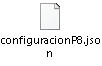

# Integración FileNet P8 Flujo Externo de Validación de identidad.

> **Fuente Confluence:** [Integración FileNet P8 Flujo Externo de Validación de identidad.](https://segurosti.atlassian.net/wiki/spaces/EPA/pages/2625732646/Integraci%C3%B3n+FileNet+P8+Flujo+Externo+de+Validaci%C3%B3n+de+identidad.)
> **Última modificación:** 2022-07-12 — Alejandra Zuleta Gonzalez (Unlicensed) · versión 4
> **Sección:** [Microservicio - P8](./index.md)

**Objetivo**:

Subir documentos a FileNet P8.

**Comunicación:**
.png>)
**Descripción**:

El microservicio escucha continuamente los comandos encolados en la cola *appp8 *con el evento de nombre `Documents.identity.p8.upload`, cada minuto y una ves sean procesados los mensajes, la respuesta a estos se encolaran con el nombre `Documents.identity.p8.completed`.

Con el mensaje de entrada se realiza la consulta del documento en el AzureStorage mediante el nombre del archivo el cual se busca en la ruta en donde se almacenan los documentos, tambien se busca la plantilla de propiedades con la que se realizara la carga de los documentos, esta se buscan con el parametro idDocumento el cual es el nombre de la plantilla que tambien se encuentra almacenada en el AzureStorage y que después seran cargados al Filene tP8.

1. Se consultan los documentos en el AzureStorage y se obtienen los objetos a transferir, los documentos a cargar se representan en base64.
2. Una vez se obtiene el documento a cargar y su respectiva metadata se procede a cargar el documento al FileNet P8 mediante Servicio Rest.
3. La respuesta que arroja el servicio se notifica como comando a Services Bus.

**Json Entrada:**

{**"dni"**: **""**,**"idDocumento"**: **""**,**"nombreArchivo"**: **""**,**"mimeType"**: **""**,**"evaluacionId"**: **""**,

**"idSarlaft"**: **""**,**"propiedades"**: [{ **"nombre"**: **""**, **"valor"**: **""**},{ **"nombre"**: **""**, **"valor"**: **""**}]}

**Json Salida:**

{**"idP8"**: **""**,**"mensajeError"**: **""**,**"dni"**: **""**,**"documentoId"**: **""**,**"evaluacionId"**: **"",**

**"idSarlaft"**: **""**}

**Mapeo entre datos servicio de carga FileNet P8:**

Mapeo del mensaje de entrada del mensaje con el mensaje del request ws rest, los datos se mapean con base al objeto que se procesa al consultar el AzureStorage.

| Representación en base 64 del archivo | content |
| --- | --- |
| Valor de configuración folderManagement | folder |
| nombreArchivo | name |
| Valor de configuración documentClass | className |
| Valor de configuración properties, con los valores reemplazados del dato de entrada propiedades. | properties |
| mimeType | mimeType |

Coleccion Postman con request de ejemplo al servicio de carga de archivos de FileNet P8

**Dependencias Ecosistema Sura:**

**Url DLLO:**

[http://p8appdll.suranet.com/ServiciosRest/v1/Documentos/](http://p8appdll.suranet.com/ServiciosRest/v1/Documentos/)

**Url LABO:**

[https://p8applab.suranet.com/ServiciosRest/v1/Documentos/](https://p8applab.suranet.com/ServiciosRest/v1/Documentos/)
