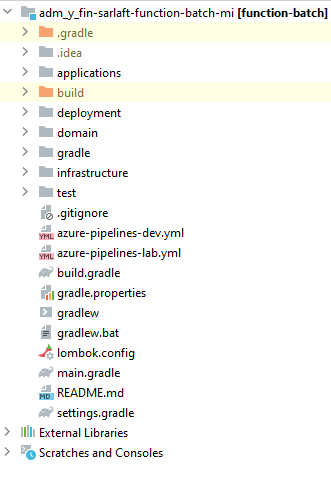
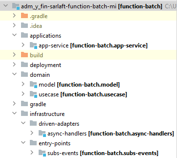

# Estructura del proyecto - Microservicio Procesos Masivos

> **Fuente Confluence:** [Estructura del proyecto - Microservicio Procesos Masivos](https://segurosti.atlassian.net/wiki/spaces/EPA/pages/2105737306/Estructura+del+proyecto+-+Microservicio+Procesos+Masivos)
> **Última modificación:** 2022-06-29 — Alejandra Zuleta Gonzalez (Unlicensed) · versión 2
> **Sección:** [Microservicio - Procesos Masivos](./index.md)

El microservicio batch está construida a partir del generador de legos de Sura, se basa en arquitectura hexagonal, generando los siguientes componentes:

Figura 1. Estructura del proyecto.

El proyecto está dividido en los siguientes subproyectos (Figura 2):

Figura 2. Subproyectos.

1. **applications-app-service**: contiene configuraciones generales del aplicativo, importa los módulos de las otras capas que siguen la Clean Architecture (Dominio e Infraestructura). Es la encargada de la interacción con el framework utilizado, sus complementos y la configuración de la ejecución de la Azure Function.

En el archivo de configuración application.yaml se encuentran las propiedades parametrizables para la publicación del comando de respuesta en el RabbitMq (host, username, password) y el nombre de la aplicación objetivo a la cual le envía el comando de respuesta.

Adicionalmente, las configuraciones para escuchar la cola en el RabbitMQ Sura se encuentran en los archivos host.json y local.settings.json.

**2. domain**: La capa de dominio es la capa más interna del proyecto y es la encargada de dar las directivas del proceso teniendo en cuenta la lógica de negocio:

- **model**: representa los objetos de dominio (negocio) del aplicativo, sus características y comportamientos.
- **use-case**: contiene el único caso de uso desarrollado donde transporta/comunica la información que escucha en el rabbitMQ Sura y luego publica con dirección al sarlaft api. Se ejecutan en la aplicación desde el proxy de la capa de infraestructura. El mensaje de entrada no es convertido ni deserializado, si no que se publica el texto plano tal cual como se recibe.

**3. infrastructure**:

- **driven-adapters-async-handlers: **adaptador que permite la comunicación por medio de RabbitMq para la emisión del comando de salida con la informacion recibida.
- **entry-points-subs-events: **receptor donde se asigna el nombre de la cola en el RabbitMQ desde el cual escucha la información y que dispara las Azure Function.
