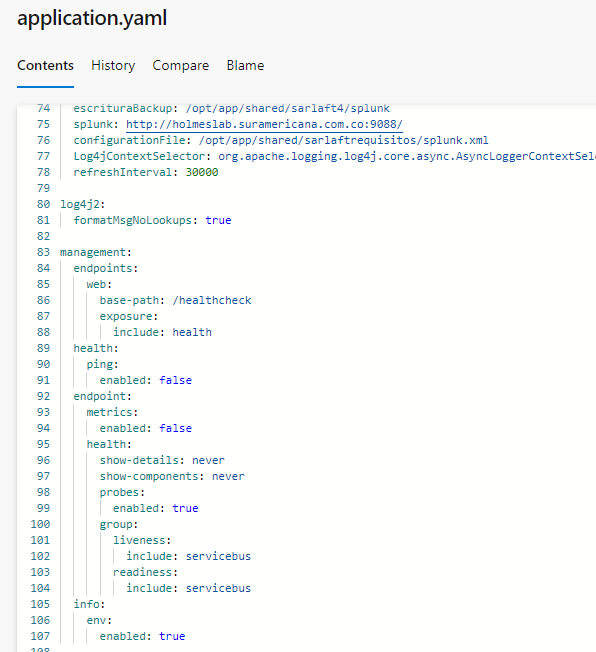
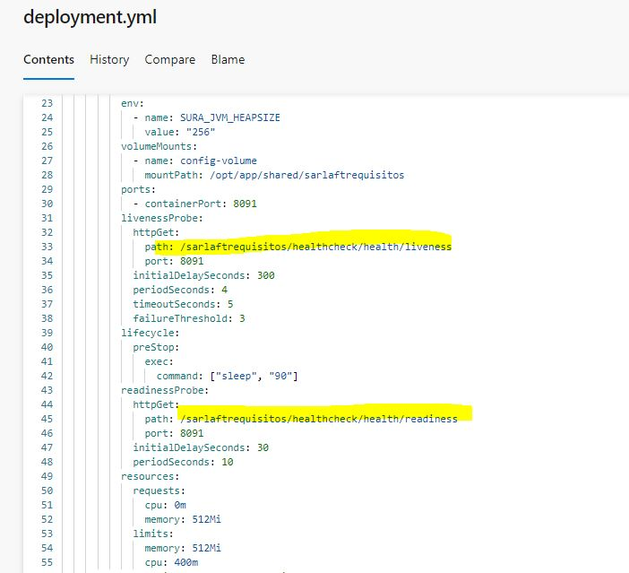

# Configuración HealtchCheck con librería actuator Requisitos

> **Fuente Confluence:** [Configuración HealtchCheck con librería actuator Requisitos](https://segurosti.atlassian.net/wiki/spaces/EPA/pages/3617882114/Configuraci%C3%B3n+HealtchCheck+con+librer%C3%ADa+actuator+Requisitos)
> **Última modificación:** 2024-04-04 — Diana Muñoz · versión 2
> **Sección:** [Microservicio - Requisitos](./index.md)

Este nuevo servicio web de healthCheck permite evaluar las conexiones principales del microservicio de tal forma que cuando desde el aks en azure, se haga el ping para evaluar la salud del microservicio se evalué la conexión al service bus de azure.

Con la librería de spring actuator `spring-boot-starter-actuator` se logra este objetivo, se incluye la librería en el main.gradle

La validación con el service bus se utiliza una clase personalizada `ServicebusHealthIndicator`.

Se realiza la siguiente configuración en el **application.properties**

Se realiza la siguiente configuración en el archivo deployment.yml en el proyecto de configuración para cada ambiente.

