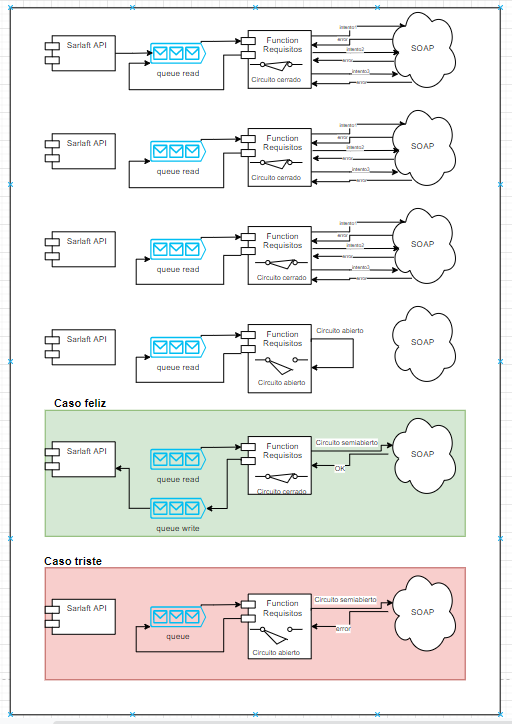

# Creación/Actualización Requisito

> **Fuente Confluence:** [Creación/Actualización Requisito](https://segurosti.atlassian.net/wiki/spaces/EPA/pages/2097512672/Creaci%C3%B3n/Actualizaci%C3%B3n+Requisito)
> **Última modificación:** 2022-07-12 — Alejandra Zuleta Gonzalez (Unlicensed) · versión 3
> **Sección:** [Microservicio - Requisitos](./index.md)

**Objetivo**:

Crear un requisito para un cliente y actualizar su estado (Finalizado y Adjuntado), para actualizar su requisito debo consultar su nro de secuencia

**Comunicación:**
.png>)
**Descripción**:

Utilizando la librería de reactive-commons se escuchan las peticiones encoladas en la cola *requisitos* con los comandos de nombre** *****Documents.requirement.insert** *y ***Documents.requirement.update***.

Nota: internamente la función requisitos utiliza los patrones Circuit Braker y Retry para asegurarse de la entrega del mensaje de la siguiente manera:

**Comando *****Documents.requirement.insert:***

Se convierten los campos, siguiendo el manual del modelo de requisitos para crear el request para consumir la operación *insertarRequisitoCliente*, posteriormente, se convierte la respuesta del servicio y datos de mensajes de entrada para enviar comando ***Documents.requirement.created***** **a la cola la cola *SarlaftApi*.

**Mensaje de entrada:**

{

“operacion” : “INSERT”,

“dni: “”,

“codigoRequisito” : “”,

“dniSolicitante” : “”,

“descripcion” : “”,

“evaluacionId” : “”

}

**Mensaje de salida:**

{

“resultado” : “”, (posibles valores true/false)

“mensajeError” : “”,

“dni” : “”,

“codigoRequisito” : “”,

“evaluacionId” : “”

}

**Mapeo entre datos:**

| resultado | Dato de response de la operación |
| --- | --- |
| mensajeError | Dato de response de la operación |
| dni | Dato del cliente recibido en el mensaje de entrada |
| codigoRequisito | Dato del cliente recibido en el mensaje de entrada |
| evaluacionId | Dato del cliente recibido en el mensaje de entrada |

** **

**Comando *****Documents.requirement.update:***

Se convierten los campos, siguiendo el manual del modelo de requisitos para crear el request para consumir las operación *getRequisitosPendientes, actualizarEstado y actualizarEstadoDigital*, posteriormente, se convierte la respuesta del servicio y datos de mensajes de entrada para enviar comando ***Documents.requirement.updated*** a la cola la cola *SarlaftApi*.

**Mensaje de entrada:**

{

“operacion” : “UPDATE”,

“dni: “”,

“codigoRequisito” : “”,

“dniSolicitante” : “”,

“descripcion” : “”,

“idP8” : “”,

“evaluacionId” : “”

}

**Mensaje de salida:**

{

“resultado” : “”, (posibles valores true/false)

“mensajeError” : “”,

“dni” : “”,

“codigoRequisito” : “”,

“evaluacionId” : “”

}

**Mapeo entre datos:**

| resultado | Dato de response de la operación |
| --- | --- |
| mensajeError | Dato de response de la operación |
| dni | Dato del cliente recibido en el mensaje de entrada |
| codigoRequisito | Dato del cliente recibido en el mensaje de entrada |
| evaluacionId | Dato del cliente recibido en el mensaje de entrada |

** **

**Dependencias Ecosistema Sura:**

**WS Consulta:**

**Url DLLO:**

[http://segdllo01.suranet.com:80/requisitos/services/WsConsultasRequisitosNoSeguro](http://segdllo01.suranet.com:80/requisitos/services/WsConsultasRequisitosNoSeguro)

**Url LABO:**

[http://appslab.suranet.com/requisitos/services/WsConsultasRequisitosNoSeguro](http://appslab.suranet.com/requisitos/services/WsConsultasRequisitosNoSeguro)

**WS Actualización:**

**Url DLLO:**

[http://segdllo01.suranet.com:80/requisitos/services/WsActualizacionesRequisitosNoSeguro?wsdl](http://segdllo01.suranet.com:80/requisitos/services/WsActualizacionesRequisitosNoSeguro?wsdl)

**Url LABO:**

[http://a](http://a)[ppslab.suranet.com:80/requisitos/services/WsActualizacionesRequisitosNoSeguro](http://ppslab.suranet.com:80/requisitos/services/WsActualizacionesRequisitosNoSeguro)
