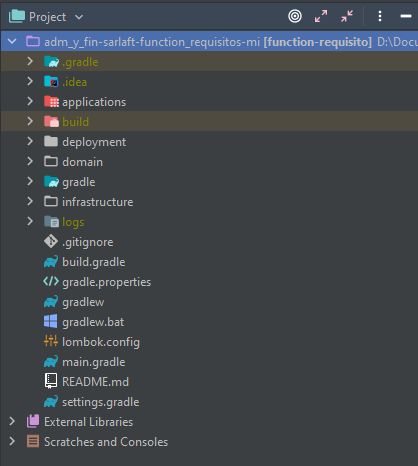
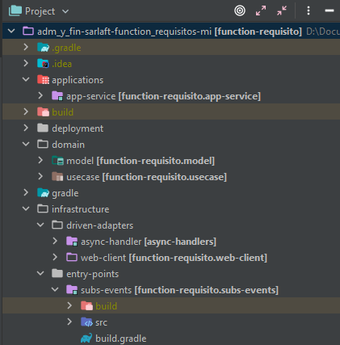

# Estructura Proyecto - Microservicio Requisitos

> **Fuente Confluence:** [Estructura Proyecto - Microservicio Requisitos](https://segurosti.atlassian.net/wiki/spaces/EPA/pages/2093253323/Estructura+Proyecto+-+Microservicio+Requisitos)
> **Última modificación:** 2022-06-22 — Alejandra Zuleta Gonzalez (Unlicensed) · versión 2
> **Sección:** [Microservicio - Requisitos](./index.md)

La función Requisitos está construida a partir del generador de legos de Sura, se basa en

arquitectura hexagonal, generando los siguientes componentes:

Figura 1. Estructura del proyecto.

El proyecto está dividido en los siguientes subproyectos (Figura 2):

Figura 2. Subproyectos.

1. **applications-app-service**: contiene configuraciones generales del aplicativo, importa los módulos de las otras capas que siguen la Clean Architecture (Dominio e Infraestructura). Es la encargada de la interacción con el framework utilizado, sus complementos y la configuración de la ejecución de la Azure Function.

En el archivo de configuración application.yaml se encuentran las propiedades parametrizables para la suscripción y escucha del comando de entrada (rabbitmq) y el nombre del comando escuchado..

**2. domain**: La capa de dominio es la capa más interna del proyecto y es la encargada de dar las directivas del proceso teniendo en cuenta la lógica de negocio:

**a. model**: representa los objetos de dominio (negocio) del aplicativo, sus características y comportamientos.

**b. use-case**: contiene el único caso de uso (actividad) que se ejecuta en la aplicación desde el proxy de la capa de infraestructura. Interactúa con los modelos para la validación de los campos obligatorios en el mensaje de salida.

**3. infrastructure**:

**a.driver-adapters-web-client: **adaptador que permite el consumo de servicios SOAP.

**b. driven-adapters-async-query-handler: **adaptador que permite la subscripción y escucha del query de entrada y enviar el comando de salida.

**c. entry-points-subs-events: **paquete donde se configura la azure function y el timmer que la dispara.
