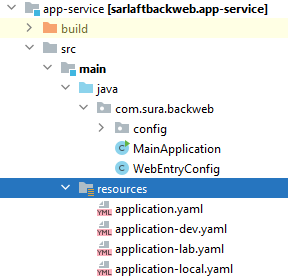
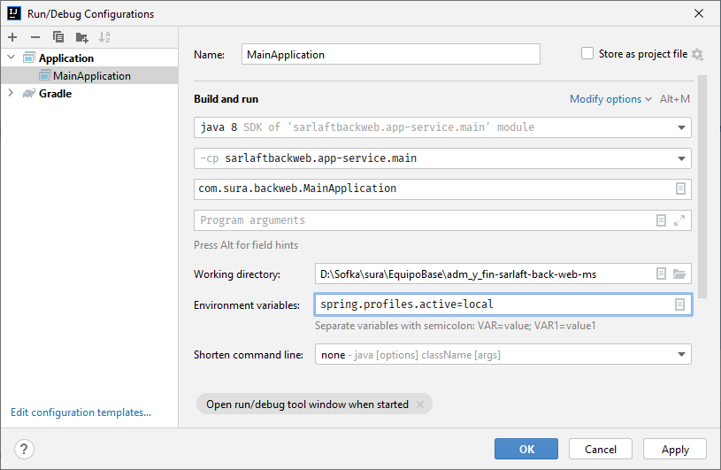

# Configuración Ambiente - Microservicio Backweb

> **Fuente Confluence:** [Configuración Ambiente - Microservicio Backweb](https://segurosti.atlassian.net/wiki/spaces/EPA/pages/2398715932)
> **Última modificación:** 2025-12-29 — versión 10
> **Sección:** [Microservicio Backweb](./index.md)

**Requisitos:**

- Java 21
- Gradle `8.10`

> ⚠️ **Corrección (2026-04-08):** La versión de Gradle documentada anteriormente era `8.10.2`. El archivo `main.gradle` del repositorio especifica `gradleVersion = '8.10'`.

**URL Repositorio:**

[https://dev.azure.com/SuraColombia/Gerencia_Tecnologia/_git/892-sarlaft-admin-ms](https://dev.azure.com/SuraColombia/Gerencia_Tecnologia/_git/892-sarlaft-admin-ms)

**URL Repositorio proyecto configuración:**

[https://dev.azure.com/SuraColombia/Gerencia_Tecnologia/_git/892-sarlaft-admin-conf](https://dev.azure.com/SuraColombia/Gerencia_Tecnologia/_git/892-sarlaft-admin-conf)

**URL Acceso local:**

[http://localhost:8091/sarlaftbackweb/](http://localhost:8091/sarlaftbackweb/resultevaluation)

> ⚠️ **Corrección (2026-04-08):** La URL documentada anteriormente era `localhost:6380`, que corresponde al puerto de **Redis Cache**, no al aplicativo. El puerto real del microservicio según `application.yaml` es `8091`.

**URL Acceso desarrollo:**

[http://sarlaftapi.dllosura.com/sarlaftbackweb/](http://sarlaftapi.dllosura.com/sarlaftbackweb/resultevaluation)

**URL Acceso laboratorio:**

[https://sarlaftapi.labsura.com/sarlaftbackweb/](https://sarlaftapi.labsura.com/sarlaftbackweb/resultevaluation)

**Pipeline con template:**

[https://dev.azure.com/SuraColombia/Gerencia_Tecnologia/_build?definitionId=4125](https://dev.azure.com/SuraColombia/Gerencia_Tecnologia/_build?definitionId=4125)

**Sonarqube:**

[https://sonarqube.suramericana.com.co/solucionescorporativas/dashboard?id=892-sarlaft-admin-ms&branch=release%2FRelease_JUL2024](https://sonarqube.suramericana.com.co/solucionescorporativas/dashboard?id=892-sarlaft-admin-ms&branch=release%2FRelease_JUL2024)

### Ejecución del proyecto en local

Para la ejecución del proyecto desde el IntelliJ IDE se proveen tres archivos de configuración de perfilamiento para que se ejecute la aplicación con configuraciones de ambiente diferentes.

Dev, lab y local los cuales van configurados según las dependencias de su ambiente y los cuales defines al momento de la ejecución de la aplicación desde tu IDE con la variable de entorno **spring.profiles.active=local**

Para pruebas en el ambiente local se tiene otro 'string connection' para pruebas con un service-bus privado pero se puede cambiar al 'string connection' de dev.
