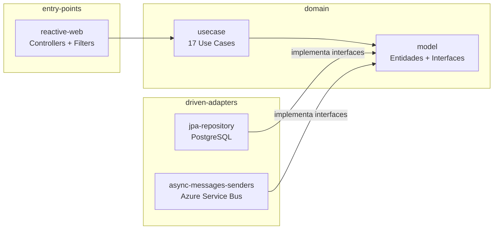

# Diseño Arquitectura

> **Fuente Confluence:** [Diseño Arquitectura](https://segurosti.atlassian.net/wiki/spaces/EPA/pages/2398159023)
> **Última modificación:** 2021-09-17 — Alejandra Zuleta Gonzalez (Unlicensed) · versión 1
> **Sección:** [Microservicio Backweb](./index.md)

> ✅ **Contenido agregado (2026-04-08):** Esta página no tenía contenido en Confluence. Se documenta aquí la arquitectura real del microservicio según análisis del código fuente con Serena MCP. Ver documento GPS completo en [GPS Arquitectura](../../../../892-sarlaft-admin-ms/docs/architecture/index.md).

---

## Patrón arquitectónico: Clean Architecture

El microservicio `sarlaftbackweb` implementa **Clean Architecture** con separación estricta entre dominio e infraestructura. El dominio nunca depende de clases de infraestructura — la dependencia siempre apunta hacia adentro (hacia el dominio).

```
applications/app-service          ← Punto de arranque (@SpringBootApplication)
│
├── domain/
│   ├── model/                    ← Entidades, Gateway interfaces, Repository interfaces
│   └── usecase/                  ← 17 casos de uso (lógica de negocio pura)
│
└── infrastructure/
    ├── entry-points/
    │   └── reactive-web/         ← Controllers WebFlux, filtros JWT y Rate Limiting
    ├── driven-adapters/
    │   ├── jpa-repository/       ← Implementación repositorios (PostgreSQL)
    │   └── async-messages-senders/ ← Implementación gateways (Azure Service Bus)
    └── helpers/
        ├── security-commons/     ← JwtManager, JwtSecurityFilter
        └── logger-config-commons/ ← MessageLogger → Splunk
```

### Diagrama de capas



---

## Stack tecnológico

| Capa | Tecnología | Versión |
|------|-----------|---------|
| Lenguaje | Java | 21 |
| Framework | Spring Boot | 3.3.5 |
| Web | Spring WebFlux (reactivo) | — |
| Persistencia | Spring Data JPA + PostgreSQL | JDBC 42.7.4 |
| Mensajería | ReactiveCommons async-service-bus-starter | 1.1.39-BETA |
| Caché | Spring Cache + Azure Redis | puerto SSL 6380 |
| Seguridad SSO | ssosura-java-reactive-17 | 1.1.5 |
| Auth JWT | Auth0 JWT (HMAC256) | — |
| Rate Limiting | Resilience4j | 2.2.0 |
| Logging | Log4j2 + Splunk library | 1.7.3 |
| Build | Gradle multi-módulo | 8.10 |

---

## Patrones clave

- **Gateway Pattern**: Interfaces en el domain (`PepsGateway`, `AsesorGateway`, `CatalogoGateway`, `NotificacionEstadoGateway`, `TokenGateway`) implementadas en infrastructure — el dominio nunca sabe cómo se implementa la integración.
- **Dual DataSource (Read/Write)**: Conexiones PostgreSQL separadas para operaciones de lectura y escritura. Patrón `@ReadOnlyRepository` — ver [DatasourceConexionesMultiples.md](./DatasourceConexionesMultiples.md).
- **Reactive Streams**: Todo el flujo es `Mono<T>` end-to-end desde el controller hasta el repositorio/gateway. No hay bloqueos síncronos.
- **Request-Reply Async**: Los adapters de mensajería usan `gateway.requestReply()` sobre Azure Service Bus para consultas y `gateway.sendCommand()` para notificaciones one-way.

---

## Seguridad

| Mecanismo | Aplica a | Detalles |
|-----------|---------|---------|
| SSO Sura (`@EnableReactiveSuraSecurity`) | Mayoría de endpoints | Autenticación OAuth/SAML — integración con SEUS |
| JWT custom (HMAC256) | Endpoints web component / asesor | Header `x-authorization-asesor` + `x-app` + `x-codAsesor` |
| `JwtSecurityFilter` | Todos los requests | WebFilter HIGHEST_PRECEDENCE, agrega headers HSTS |
| `RateLimitingFilter` | Todos los requests | Resilience4j por IP, configurable por properties |
| TLS | PostgreSQL, Redis | `sslmode=require` en JDBC, Puerto 6380 SSL para Redis |
| CORS | Origenes permitidos | `sarlaft.dllosura.com`, `suraenlinea.com`, `localhost.sura.com.co:4200` |

---

## Integraciones externas

| Sistema | Protocolo | Propósito |
|---------|-----------|-----------|
| SEUS (SSO Sura) | HTTPS/SSO | Autenticación principal |
| Azure PostgreSQL | JDBC/TLS | Persistencia (`sarlaftdb`, schema `sarlaft`) |
| Azure Service Bus | AMQP/TLS | Bus de mensajería con ecosistema Sarlaft |
| Azure Redis | TLS:6380 | Caché de asesores y aplicaciones (TTL 6900s) |
| Splunk | TCP/HTTPS | Logging centralizado |
| SonarQube | HTTPS | Calidad de código |

> Para servicios concretos expuestos, ver [ServiciosWeb/index.md](./ServiciosWeb/index.md).
> Para el inventario completo de casos de uso, gateways y repositorios, ver el [GPS Arquitectónico](../../../../892-sarlaft-admin-ms/docs/architecture/index.md).
