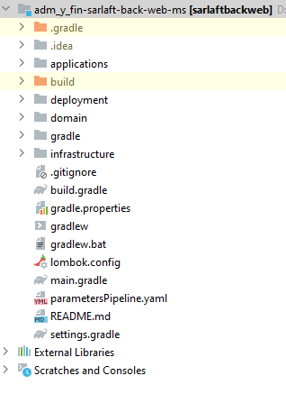
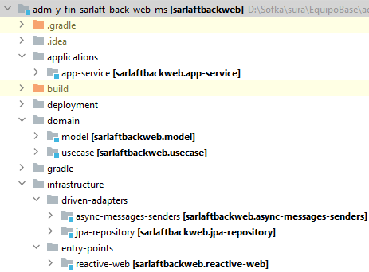

# Estructura Proyecto - Microservicio Backweb

> **Fuente Confluence:** [Estructura Proyecto - Microservicio Backweb](https://segurosti.atlassian.net/wiki/spaces/EPA/pages/2397339707)
> **Última modificación:** 2022-04-01 — Diana Muñoz · versión 2
> **Sección:** [Microservicio Backweb](./index.md)

---

Se basa en una arquitectura hexagonal y tiene los siguientes componentes:



*Figura 1. Estructura del proyecto.*

El proyecto está dividido en los siguientes subproyectos (Figura 2):



*Figura 2. Subproyectos.*

**1. applications-app-service**: contiene configuraciones generales del aplicativo, importa los módulos de las otras capas que siguen la Clean Architecture (Dominio e Infraestructura). Es la encargada de la interacción con el framework utilizado, sus complementos y la configuración de la ejecución del microservicio.

En el archivo de configuración `application.yaml` se encuentran las propiedades parametrizables para consulta de catálogos por service bus de azure, los parámetros para consumir base de datos y seguridad SEUS.

**2. domain**: La capa de dominio es la capa más interna del proyecto y es la encargada de dar las directivas del proceso teniendo en cuenta la lógica de negocio:

- **model**: representa los objetos de dominio (negocio) del aplicativo, sus características y comportamientos.
- **use-case**: contiene el único caso de uso (actividad) que se ejecuta en la aplicación desde el proxy de la capa de infraestructura. Interactúa con los modelos para la conversión de los datos encontrados en los repositorios al modelo necesario.

**3. infrastructure**:

- **driven-adapters-async-messages-senders:** adaptador que permite la comunicación para solicitar por query el catálogo de países.
- **driven-adapters-jpa-repository:** aquí se encuentran las implementaciones para el control de persistencia de los objetos de dominio, además de implementaciones concretas para consulta de información de base de datos.
- **entry-points-reactive-web:** define los diferentes endpoints que se habilitarán en la aplicación, aquí se ubican los controllers que exponen los métodos de API Rest.

**Configuración base de datos**

La configuración de base de datos del proyecto se realiza en base al archivo `application.yml` del proyecto `applications-app-service`, adicional de contener la clase `JpaConfig.java` de configuración para la conexión la cual en un momento dado nos permitirá aplicar las configuraciones que se necesiten a la medida.

Properties

```yaml
spring:
  application:
    name: sarlaftbackweb
  datasource:
    driverClassName: "org.postgresql.Driver"
    url: "jdbc:postgresql://psql-srsarlaftd12576809.postgres.database.azure.com:5432/sarlaftdb?currentSchema=sarlaft&sslmode=require"
    username: "usuario"
    password: "password"
  jpa:
    show-sql: true
    database: postgresql
    databasePlatform: org.hibernate.dialect.PostgreSQLDialect
  redis:
    host: usuario
    password: password
    ssl: true
    abortConnect: false
    port: 6380
    type: redis
  cache:
      redis:
        time-to-live: 6900000
        cache-null-values: true
azure:
  connection-string: url conexion
```

Configuration

```java
...

@Configuration
public class JpaConfig {

    @Bean
    public DBSecret dbSecret(Environment env) {
        return DBSecret.builder()
                .url(env.getProperty("spring.datasource.url"))
                .username(env.getProperty("spring.datasource.username"))
                .password(env.getProperty("spring.datasource.password"))
                .build();
    }

    @Bean
    public DataSource datasource(DBSecret secret, @Value("${spring.datasource.driverClassName}") String driverClass) {
        HikariConfig config = new HikariConfig();
        config.setJdbcUrl(secret.getUrl());
        config.setUsername(secret.getUsername());
        config.setPassword(secret.getPassword());
        config.setDriverClassName(driverClass);
        return new HikariDataSource(config);
    }

    @Bean
    public LocalContainerEntityManagerFactoryBean entityManagerFactory(
            DataSource dataSource,
            @Value("${spring.jpa.databasePlatform}") String dialect) {
        LocalContainerEntityManagerFactoryBean em = new LocalContainerEntityManagerFactoryBean();
        em.setDataSource(dataSource);
        em.setPackagesToScan("com.sura.backweb.jpa");

        JpaVendorAdapter vendorAdapter = new HibernateJpaVendorAdapter();
        em.setJpaVendorAdapter(vendorAdapter);

        Properties properties = new Properties();
        properties.setProperty("hibernate.dialect", dialect);
        em.setJpaProperties(properties);

        return em;
    }
}
```
