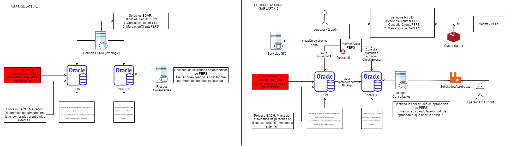

# Diseño y Arquitectura PEPS MS

> **Fuente Confluence:** [Diseño y Arquitectura PEPS MS](https://segurosti.atlassian.net/wiki/spaces/EPA/pages/1800700343)
> **Espacio:** EPA
> **Última modificación Confluence:** 2021-03-26 | Versión 2
> **Sección:** [Microservicio PEPS](../index.md)

Este diagrama muestra la interacción del proceso de validación y solicitudes peps con el sistema de sarlaft

## Contenido

| Página | Archivo |
|--------|---------|
| Configuración base de datos en producción | [ConfiguracionBDProduccion.md](ConfiguracionBDProduccion.md) |
