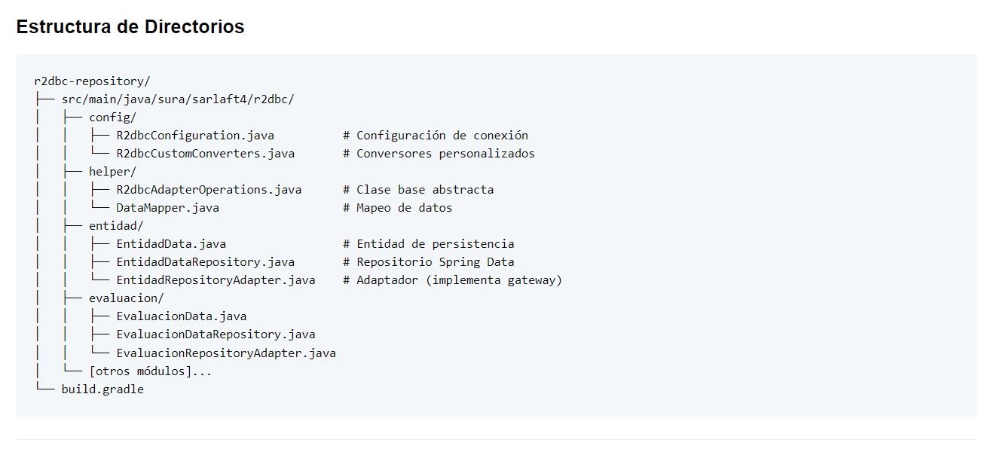
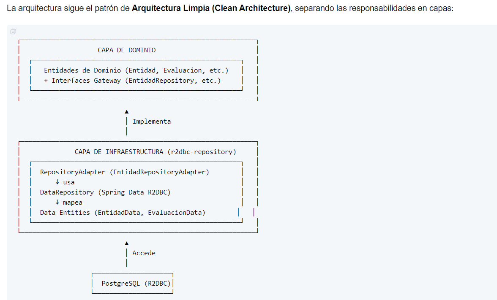

# Configuración Base de Datos R2DBC

> **Fuente Confluence:** [Configuración Base de Datos R2DBC](https://segurosti.atlassian.net/wiki/spaces/EPA/pages/5268635850)
> **Última modificación:** 2025-12-29 — Diana Muñoz · versión 1
> **Sección:** [Estructura Proyecto](./index.md)
## Configuración en `application.yml`

```yaml
spring.r2dbc.url: r2dbc:postgresql://<<hostDB>>.postgres.database.azure.com:5432/<<baseDeDatos>>?schema=<<esquemaSarlaft>>&sslmode=require
spring.r2dbc.username: modsarlaftd
spring.r2dbc.password: ${SECRET-DB-SARLAFT}
spring.r2dbc.pool.initialSize: 10
spring.r2dbc.pool.maxSize: 10
spring.r2dbc.pool.maxAcquireTime: PT60S
spring.r2dbc.pool.maxIdleTime: PT30M
```text

---

## `driven-adapters - r2dbc-repository`

Este módulo implementa el acceso reactivo a la base de datos **PostgreSQL** utilizando **R2DBC (Reactive Relational Database Connectivity)**. R2DBC es un estándar que permite la interacción reactiva con bases de datos relacionales, proporcionando operaciones no bloqueantes que se integran perfectamente con Spring WebFlux y Project Reactor.

### Ventajas de R2DBC

- **No bloqueante**: Operaciones asíncronas que no bloquean hilos
- **Escalabilidad**: Mejor uso de recursos con menos hilos
- **Integración reactiva**: Compatible con `Mono` y `Flux` de Project Reactor
- **Rendimiento**: Manejo eficiente de alta concurrencia





---

## Componentes Principales

### 1. Data Entities (Entidades de Persistencia)

Las clases `*Data.java` representan la estructura de las tablas en la base de datos.

**Características:**
- Anotadas con `@Table` para especificar la tabla
- Campos anotados con `@Column` para mapear columnas
- Implementan `Persistable<ID>` para control de persistencia
- Usan `@Id` para la clave primaria
- Soportan auditoría con `@CreatedDate` y `@LastModifiedDate`

### 2. Data Repositories (Repositorios Spring Data)

Las interfaces `*DataRepository.java` extienden `ReactiveCrudRepository` y definen métodos de consulta.

**Características:**
- Extienden `ReactiveCrudRepository<Entity, ID>`
- Proporcionan operaciones CRUD básicas automáticas
- Permiten definir consultas personalizadas con `@Query`
- Retornan tipos reactivos: `Mono<T>` o `Flux<T>`

### 3. Repository Adapters (Adaptadores)

Las clases `*RepositoryAdapter.java` implementan los gateways del dominio y adaptan entre las entidades de dominio y las entidades de persistencia.

**Características:**
- Implementan las interfaces gateway del dominio
- Extienden `R2dbcAdapterOperations<Domain, Data, ID>`
- Realizan mapeo bidireccional (Domain ↔ Data)
- Manejan relaciones entre entidades
- Aplican lógica de transformación específica

### Clase Base: `R2dbcAdapterOperations`

Esta clase abstracta proporciona operaciones comunes de mapeo y transformación.

**Funcionalidades:**
- Mapeo automático entre entidades Domain y Data
- Transformación de tipos reactivos (Mono, Flux)
- Gestión de identificadores
- Reutilización de código común

---

## Control de Inserción vs. Actualización

El método `isNew()` de `Persistable<T>` determina la operación:

```java
@Transient
@Override
public boolean isNew() {
    return this.fechaCreacion == null;
}
```sql

**Lógica:**
- `true` (fechaCreacion == null) → INSERT
- `false` (fechaCreacion != null) → UPDATE

**Ejemplo de uso:**

```java
// Nuevo registro (INSERT)
EntidadData nuevaEntidad = EntidadData.builder()
    .dni("123456")
    .tipo("FINASEPEN")
    .build();
// isNew() = true, porque fechaCreacion es null

repository.save(nuevaEntidad);  // Ejecuta INSERT

// Actualización (UPDATE)
repository.findById("123456")
    .map(entidad -> {
        entidad.setRazonSocial("Nueva Razón Social");
        return entidad;
        // isNew() = false, porque fechaCreacion existe
    })
    .flatMap(repository::save);  // Ejecuta UPDATE
```
