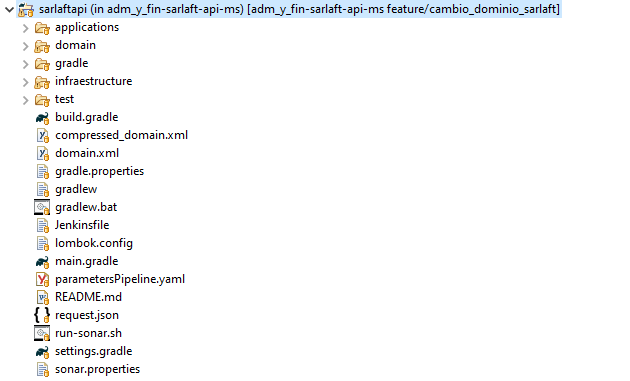
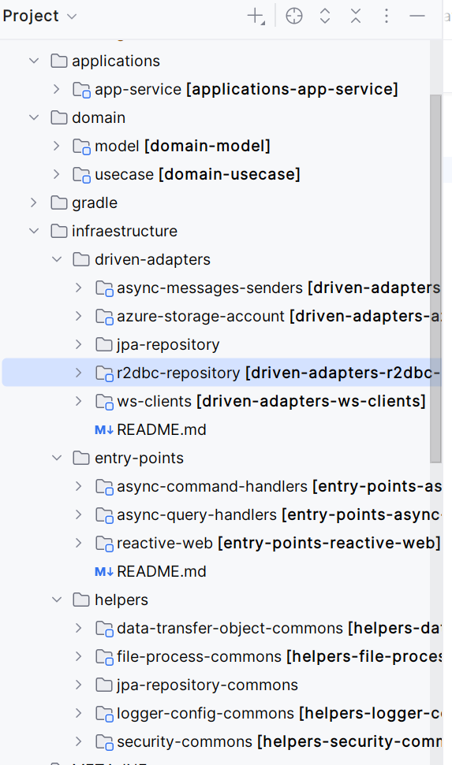

# Estructura Proyecto - SarlaftAPI

> **Fuente Confluence:** [Estructura Proyecto - SarlaftAPI](https://segurosti.atlassian.net/wiki/spaces/EPA/pages/1800700336)
> **Última modificación:** 2025-12-29 — Diana Muñoz · versión 5
> **Sección:** [Microservicio SarlaftAPI](../index.md)
## Generalidades

El API para consulta y marcación de clientes PEP está construido a partir del **generador de legos de Sura** en su versión `0.0.19`. Se basa en:

- **Arquitectura Hexagonal**
- **Programación Reactiva** (Spring WebFlux + Project Reactor)
- **Seguridad** a través de **SEUS**

---

## División del Proyecto

El proyecto está dividido en los siguientes subproyectos (Figura 2):

### `applications-app-service`

Contiene configuraciones generales del aplicativo.

### `domain-model`

Representa los objetos de dominio (negocio) del aplicativo, sus características y comportamientos.  
Los objetos están construidos de manera **inmutable**, tal que existan fábricas u objetos de comportamientos separados de su representación básica para la definición de validaciones sobre sus datos.

### `domain-usecase`

Contiene todos los **casos de uso (actividades)** que se ejecutan en la aplicación.

### `driven-adapters-r2dbc-repository`

Aquí se encuentran las implementaciones para el control de **persistencia de los objetos de dominio**, adicional de implementaciones concretas para consulta de información de base de datos.

### `entry-points-reactive-web`

Define los diferentes **endpoints** que se habilitarán en la aplicación.  
Aquí también se encuentran las implementaciones de invocación a **servicios SOAP** requeridos para consultar y registrar información de personas.

### `helpers-jpa-repository-commons`

Representa objetos utilitarios para el manejo de persistencia. Este es usado directamente por `driven-adapters-jpa-repository`.

---

## Clases Especiales

### `DataMapper.java`

Función: transformar datos de dominio hacia entidades de base de datos y viceversa (mapeo bidireccional Domain ↔ Data).

### `DomainFactory.java`

Función: construir un objeto de tipo `Assessment` con todos y cada uno de los datos que lo componen.

### `HealthCheckService.java`

Usada para verificar que la aplicación se encuentre instalada y activa.

---

## Subpáginas

- [Configuración Base de Datos R2DBC](./ConfiguracionBaseDatosR2DBC.md)
