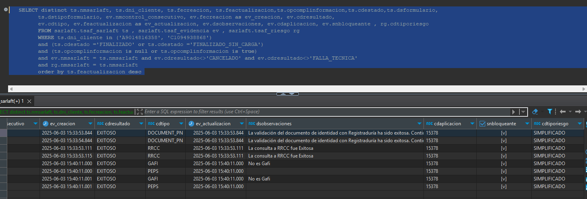

# Evitar Duplicidad en Evidencias

> **Fuente Confluence:** [Evitar Duplicidad en Evidencias](https://segurosti.atlassian.net/wiki/spaces/EPA/pages/4786421765)
> **Última modificación:** 2025-06-12 — Mauricio Marin Martinez · versión 1
> **Sección:** [Microservicio SarlaftAPI](./index.md)
Debido a los errores presentados en produccion con el mensaje ejemplo: `exception: Multiple representations of the same entity [sura.sarlaft4.jpa.evidencia.EvidenciaData#95c3345c-15b0-4e42-9f8b-d6152bd348ee] are being merged`, se vio la necesidad de crear una raizal para darle manejo al error.

El error surge cuando se invoca el servicio de agregar figura luego de haber creado una evaluacion, tanto para persona natural como para persona juridica y ocurre cuando en la consulta de historico de sarlaft de la figura que se desea agregar, existen evidencias duplicadas para la evidencia de tipo `DOCUMENT_PN`. Existe una validacion en el codigo que si la evidencia es de tipo `DOCUMENT_PN` se agrega al stack de evidencias nuevas, el problema es que si hay mas de una del mismo tipo, se va a agregar y al momento de guardar el sarlaft, va a generarse un conflicto por haber mas de una evidencia del mismo tipo.

Para darle solucion al caso, se modifica la clase `PrepararEvaluacionUtil` especificamente en la funcion `getNuevasEvidencia`.

El operador `.distinct` en Reactor conserva la primera evidencia que aparece en el flujo con un valor único de tipo. Las evidencias posteriores con el mismo tipo serán descartadas.

Ejemplo:

El microservicio realiza la consulta de evidencias para determinado DNI:

Cuando se crea el sarlaft para la nueva figura, solo crea una evidencia de cada tipo, evitando duplicados:

Iniciativa: [https://dev.azure.com/SuraColombia/Gerencia_Tecnologia/_workitems/edit/801841](https://dev.azure.com/SuraColombia/Gerencia_Tecnologia/_workitems/edit/801841)
